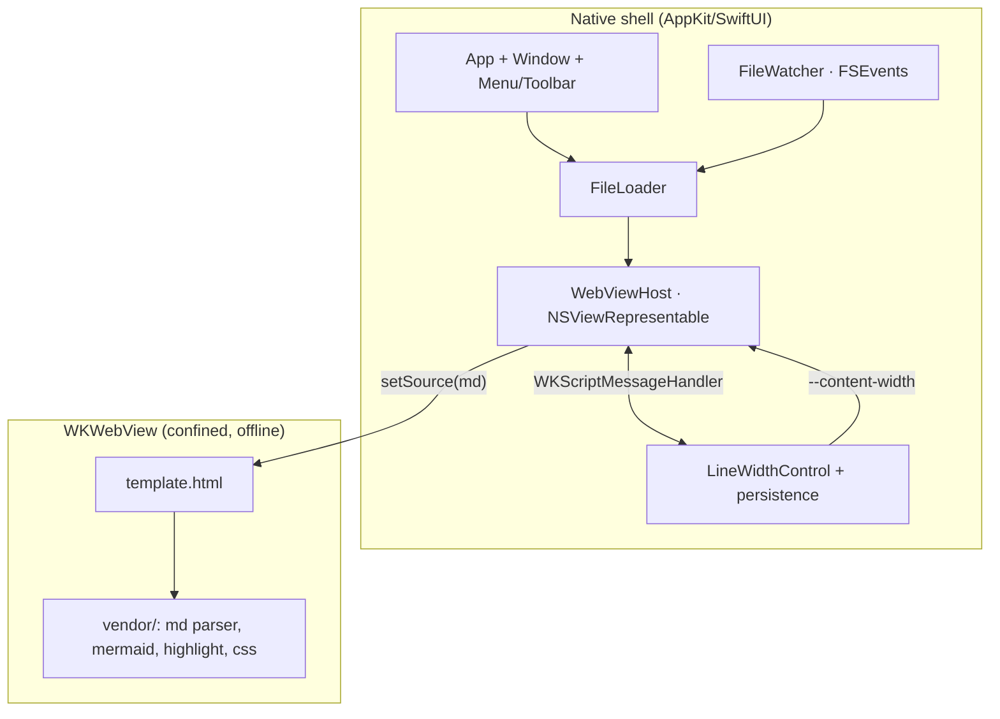

# SDS

## 1. Intro
- **Purpose:** Define the architecture and implementation approach for Markview — a native macOS Markdown previewer with GFM + Mermaid, rendered in a confined `WKWebView`, with an on-screen line-width control.
- **Rel to SRS:** Implements [REF:fr:open | FR-OPEN], [REF:fr:gfm | FR-GFM], [REF:fr:mermaid | FR-MERMAID], [REF:fr:highlight | FR-HIGHLIGHT], [REF:fr:line-width | FR-LINE-WIDTH], [REF:fr:live-reload | FR-LIVE-RELOAD], [REF:fr:appearance | FR-APPEARANCE], [REF:fr:offline | FR-OFFLINE].

## 2. Arch
- **Diagram:**

- **Subsystems:** App shell · File loader · File watcher · Render host (`WKWebView`) · Line-width control · Vendored web bundle.

## 3. Components

### 3.1 App shell [ANC:sds:app-shell]
- **Purpose:** Native window, main menu (File ▸ Open / Open Recent), toolbar, drag-and-drop, document-type registration. Hosts the render surface. Implements [REF:fr:open | FR-OPEN], [REF:fr:appearance | FR-APPEARANCE].
- **Interfaces:** Receives file URLs from Open dialog / drop / Finder; passes to FileLoader. Owns toolbar incl. the line-width control.
- **Deps:** AppKit, SwiftUI, UniformTypeIdentifiers.

### 3.2 FileLoader [ANC:sds:file-loader]
- **Purpose:** Read file contents off the main thread; hand raw Markdown text to the render host. Implements [REF:fr:open | FR-OPEN].
- **Interfaces:** `load(url) -> String`; emits updates on change events from FileWatcher.
- **Deps:** Foundation.

### 3.3 FileWatcher [ANC:sds:file-watcher]
- **Purpose:** Watch the open file for external modification; trigger reload. Implements [REF:fr:live-reload | FR-LIVE-RELOAD].
- **Interfaces:** `watch(url, onChange)`; debounced; handles atomic-save replace (re-arm on vnode delete/rename).
- **Deps:** Dispatch / FSEvents.

### 3.4 WebViewHost [ANC:sds:webview-host]
- **Purpose:** Wrap `WKWebView` via `NSViewRepresentable`; load `template.html` via `loadFileURL` with read access scoped to the resource bundle; push Markdown source and width into the page; receive messages back. Implements [REF:fr:gfm | FR-GFM], [REF:fr:mermaid | FR-MERMAID], [REF:fr:highlight | FR-HIGHLIGHT], [REF:fr:offline | FR-OFFLINE].
- **Interfaces:** `setSource(markdown)`, `setContentWidth(px)`, message handler `lineWidth`/`openLink`. Network disabled via `WKWebView` config + navigation policy.
- **Deps:** WebKit.

### 3.5 LineWidthControl [ANC:sds:line-width]
- **Purpose:** On-screen slider/stepper bound to content width; persists the value. Implements [REF:fr:line-width | FR-LINE-WIDTH].
- **Interfaces:** Reads/writes `UserDefaults` key `contentWidth`; on change calls `WebViewHost.setContentWidth`.
- **Deps:** SwiftUI, Foundation.

### 3.6 Vendored web bundle [ANC:sds:vendor]
- **Purpose:** Offline rendering assets under `Sources/Markview/Resources/vendor` + `Resources/template.html`. Implements [REF:fr:gfm | FR-GFM], [REF:fr:mermaid | FR-MERMAID], [REF:fr:highlight | FR-HIGHLIGHT], [REF:fr:offline | FR-OFFLINE].
- **Interfaces:** `template.html` exposes a JS entrypoint `render(markdown)` and reads CSS var `--content-width`.
- **Deps:** Markdown-it–class parser (GFM), `mermaid.js`, highlight library, theme CSS. Pinned versions, committed to the repo.

## 4. Data
- **Entities:** No persistent model beyond `UserDefaults`: `contentWidth: Int (px)`, recent files (system-managed `NSDocumentController` recents).
- **ERD:** N/A (no database).
- **Migration:** N/A.

## 5. Logic
- **Algos:** Render = read file → `render(markdown)` in page → md parser produces HTML → `mermaid.run()` over `.language-mermaid` blocks → highlight over remaining code blocks. Width = native control → message/eval sets `document.documentElement.style.setProperty('--content-width', ...)`; content column `max-width: var(--content-width)`.
- **Rules:** Confine `WKWebView` to bundled file URLs; intercept external links → open in default browser via `NSWorkspace` (never navigate the view). Debounce file-change events. Load file I/O off the main thread; render calls marshaled to main.

## 6. Non-Functional
- **Scale/Fault/Sec/Logs:** Off-main-thread file reads keep UI responsive on large docs. Malformed Markdown → best-effort render, no crash. Security: no network (offline FR), minimal JS bridge (width + link interception only). Logging via `os.Logger`, subsystem `dev.markview`.

## 7. Constraints
- **Simplified:** Single-document window focus; minimal toolbar (open + line width). System appearance only (no custom theme picker in v1).
- **Deferred:** Tabs/multi-doc, search-in-document, print/export, custom themes, TOC sidebar — explicitly out of v1 scope per minimalism priority.
