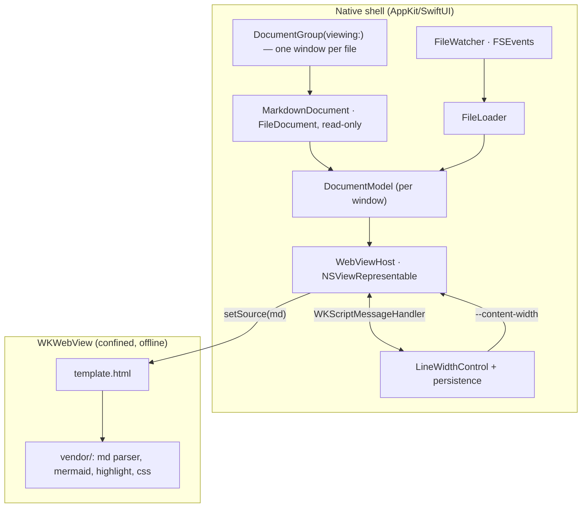

# SDS

## 1. Intro
- **Purpose:** Define the architecture and implementation approach for Markview — a native macOS Markdown previewer with GFM + Mermaid, rendered in a confined `WKWebView`, with an on-screen line-width control.
- **Rel to SRS:** Implements [REF:fr:open | FR-OPEN], [REF:fr:multidoc | FR-MULTIDOC], [REF:fr:gfm | FR-GFM], [REF:fr:mermaid | FR-MERMAID], [REF:fr:highlight | FR-HIGHLIGHT], [REF:fr:line-width | FR-LINE-WIDTH], [REF:fr:live-reload | FR-LIVE-RELOAD], [REF:fr:appearance | FR-APPEARANCE], [REF:fr:offline | FR-OFFLINE].

## 2. Arch
- **Diagram:**

- **Subsystems:** App shell (`DocumentGroup`) · Markdown document · Per-window model · File loader · File watcher · Render host (`WKWebView`) · Line-width control · Vendored web bundle.

## 3. Components

### 3.1 App shell [ANC:sds:app-shell]
- **Purpose:** `DocumentGroup(viewing: MarkdownDocument.self)` — one native window per file, with system File ▸ Open / Open Recent and state restoration. Window tabbing is disabled (`NSWindow.allowsAutomaticWindowTabbing = false` in `AppDelegate`) → strictly one window per document. Each window hosts its own render surface + toolbar. Implements [REF:fr:open | FR-OPEN], [REF:fr:multidoc | FR-MULTIDOC], [REF:fr:appearance | FR-APPEARANCE].
- **Interfaces:** `ContentView(document:fileURL:)` per window owns a `DocumentModel`. Opens originate from the system Open panel / Finder / Dock / `open` (handled by `DocumentGroup`), drag-drop onto a window (`@Environment(\.openDocument)` → new window), or a command-line argument in dev (`AppDelegate` → `NSDocumentController.shared.openDocument`). No welcome screen: a fresh launch shows the system Open panel. Windows open at 900×820 on first launch; the system restores frames thereafter.
- **Deps:** AppKit, SwiftUI, UniformTypeIdentifiers.

### 3.1a MarkdownDocument [ANC:sds:markdown-document]
- **Purpose:** Read-only `FileDocument` carrying the file's Markdown text; the unit each `DocumentGroup` window is built around. Implements [REF:fr:multidoc | FR-MULTIDOC], [REF:fr:open | FR-OPEN].
- **Interfaces:** `readableContentTypes = [md, markdown, plainText]`; `writableContentTypes = []` (never writable → no Save, never dirty); `init(data:)` decodes UTF-8 and throws on invalid bytes (fail fast); `fileWrapper(configuration:)` throws (read-only).
- **Deps:** SwiftUI, UniformTypeIdentifiers.

### 3.1c WindowTitleSetter [ANC:sds:window-title]
- **Purpose:** Show the document's full path in the title bar instead of the bare file name `DocumentGroup` defaults to. Implements [REF:fr:multidoc | FR-MULTIDOC].
- **Interfaces:** `NSViewRepresentable` (zero-size) backed by `TitlePinningView`: on `viewDidMoveToWindow` it KVO-observes `NSWindow.title` and re-asserts the full path on every change (the document machinery re-syncs the file name asynchronously, so a one-shot set loses). Clears `representedURL` because, while set, AppKit shows the file name regardless of `title` — this deliberately drops the proxy icon.
- **Deps:** AppKit, SwiftUI.

### 3.1b DocumentModel [ANC:sds:document-model]
- **Purpose:** Per-window state: owns the window's `PreviewController`, `FileWatcher`, and reading width; renders the document text and re-renders on appearance/live-reload. One instance per `DocumentGroup` window (no shared singleton). Implements [REF:fr:live-reload | FR-LIVE-RELOAD], [REF:fr:appearance | FR-APPEARANCE], [REF:fr:line-width | FR-LINE-WIDTH].
- **Interfaces:** `start(text:url:)` (one-time page setup + render + arm watcher), `setWidth(px)`, `appearanceChanged(dark:)`. Live reload re-reads `url` off-main and re-renders.
- **Deps:** AppKit, SwiftUI.

### 3.2 FileLoader [ANC:sds:file-loader]
- **Purpose:** Read file contents off the main thread; hand raw Markdown text to the render host. Implements [REF:fr:open | FR-OPEN].
- **Interfaces:** `load(url) -> String`; emits updates on change events from FileWatcher.
- **Deps:** Foundation.

### 3.3 FileWatcher [ANC:sds:file-watcher]
- **Purpose:** Watch the open file for external modification; trigger reload. Implements [REF:fr:live-reload | FR-LIVE-RELOAD].
- **Interfaces:** `watch(url, onChange)`; debounced; handles atomic-save replace (re-arm on vnode delete/rename).
- **Deps:** Dispatch / FSEvents.

### 3.4 WebViewHost [ANC:sds:webview-host]
- **Purpose:** Wrap `WKWebView` via `NSViewRepresentable`; load `template.html` via `loadFileURL` with read access scoped to the resource bundle; push Markdown source and width into the page; receive messages back. Implements [REF:fr:gfm | FR-GFM], [REF:fr:mermaid | FR-MERMAID], [REF:fr:highlight | FR-HIGHLIGHT], [REF:fr:offline | FR-OFFLINE].
- **Interfaces:** `setSource(markdown)`, `setContentWidth(px)`, message handler `lineWidth`/`openLink`. Network disabled via `WKWebView` config + navigation policy.
- **Deps:** WebKit.

### 3.5 LineWidthControl [ANC:sds:line-width]
- **Purpose:** On-screen slider/stepper bound to content width; persists the value. Implements [REF:fr:line-width | FR-LINE-WIDTH].
- **Interfaces:** Reads/writes `UserDefaults` key `contentWidth`; on change calls `WebViewHost.setContentWidth`.
- **Deps:** SwiftUI, Foundation.

### 3.6 Vendored web bundle [ANC:sds:vendor]
- **Purpose:** Offline rendering assets under `Sources/Markview/Resources/vendor` + `Resources/template.html`. Implements [REF:fr:gfm | FR-GFM], [REF:fr:mermaid | FR-MERMAID], [REF:fr:highlight | FR-HIGHLIGHT], [REF:fr:offline | FR-OFFLINE].
- **Interfaces:** `template.html` exposes JS entrypoints `render(markdown)`, `setContentWidth(px)`, `getContentWidth()`, `setDark(bool)`; reads CSS var `--content-width`. Native calls them via `callAsyncJavaScript`. Copied flat to the bundle root (template + `vendor/` siblings) so relative URLs resolve.
- **Deps (pinned, committed):** markdown-it 14.1.0 + markdown-it-task-lists 2.1.1 (wrapped as a browser global), highlight.js 11.10.0 (common langs) with github light/dark themes, mermaid 11.6.0 (UMD, `securityLevel:strict`), github-markdown-css 5.8.1. markdown-it runs with `html:false` (read-only viewer drops raw inline HTML).

## 4. Data
- **Entities:** No persistent model beyond `UserDefaults`: `contentWidth: Int (px)`. Recent files + window state are fully system-managed by `DocumentGroup` (`NSDocumentController` recents, state restoration).
- **ERD:** N/A (no database).
- **Migration:** N/A.

## 5. Logic
- **Algos:** Render = read file → `render(markdown)` in page → md parser produces HTML → `mermaid.run()` over `.language-mermaid` blocks → highlight over remaining code blocks. Width = native control → message/eval sets `document.documentElement.style.setProperty('--content-width', ...)`; content column `max-width: var(--content-width)`.
- **Rules:** Confine `WKWebView` to bundled file URLs; intercept external links → open in default browser via `NSWorkspace` (never navigate the view). Debounce file-change events. Load file I/O off the main thread; render calls marshaled to main.

## 6. Non-Functional
- **Scale/Fault/Sec/Logs:** Off-main-thread file reads keep UI responsive on large docs. Malformed Markdown → best-effort render, no crash. Security: no network (offline FR), minimal JS bridge (width + link interception only). Logging via `os.Logger`, subsystem `dev.markview`.

## 7. Constraints
- **Packaging:** `make app`/`make prod` assemble a real `Markview.app` (binary + SwiftPM resource bundle + `packaging/Info.plist`, built under `.build/`). The bundle (bundle id + `CFBundleDocumentTypes` for `.md`/`.markdown`) is what gives macOS single-instance behavior, "Open With" routing, and one-window-per-document. `make dev` runs the raw SwiftPM binary (no bundle → a separate process per launch) for fast iteration.
- **Platform:** macOS 14+ (Swift 6 language mode). Min raised from 13 → 14 to use modern SwiftUI `onChange` and keep a zero-warning build.
- **Simplified:** Read-only documents (no Save/edit); minimal toolbar (line width). System appearance only (no custom theme picker in v1). No welcome screen — fresh launch shows the system Open panel.
- **Deferred:** Search-in-document, print/export, custom themes, TOC sidebar — explicitly out of v1 scope per minimalism priority. (Window-per-document, Open Recent, and state restoration come free from `DocumentGroup`; window tabbing is deliberately disabled — one document = one window.)
