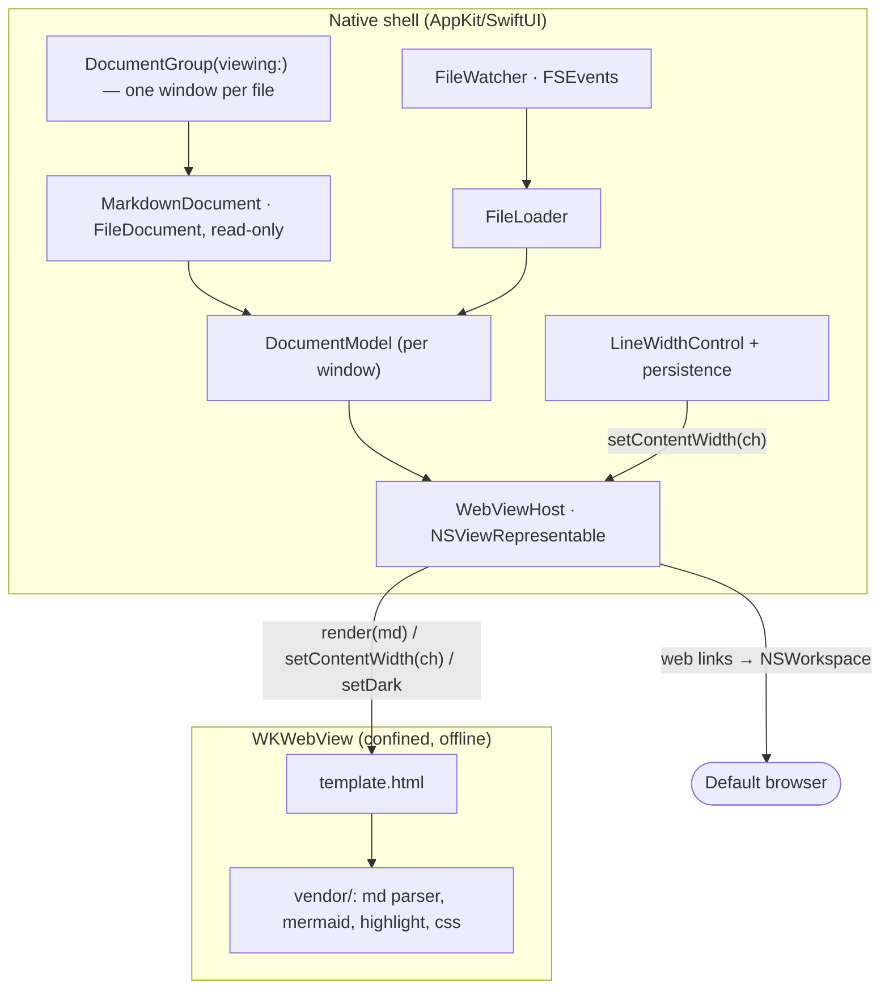

# SDS

## 1. Intro
- **Purpose:** Define the architecture and implementation approach for Markio — a native macOS Markdown previewer with GFM + Mermaid, rendered in a confined `WKWebView`, with an on-screen line-width control.
- **Rel to SRS:** Implements [REF:fr:open | FR-OPEN], [REF:fr:multidoc | FR-MULTIDOC], [REF:fr:gfm | FR-GFM], [REF:fr:mermaid | FR-MERMAID], [REF:fr:highlight | FR-HIGHLIGHT], [REF:fr:line-width | FR-LINE-WIDTH], [REF:fr:live-reload | FR-LIVE-RELOAD], [REF:fr:appearance | FR-APPEARANCE], [REF:fr:offline | FR-OFFLINE], [REF:fr:find | FR-FIND], [REF:fr:math | FR-MATH], [REF:fr:frontmatter | FR-FRONTMATTER], [REF:fr:inline-html | FR-INLINE-HTML].

## 2. Arch
- **Diagram:**

- **Subsystems:** App shell (`DocumentGroup`) · Markdown document · Per-window model · File loader · File watcher · Render host (`WKWebView`) · Line-width control · Vendored web bundle.

## 3. Components

### 3.1 App shell [ANC:sds:app-shell]
- **Purpose:** `DocumentGroup(viewing: MarkdownDocument.self)` — one native window per file, with system File ▸ Open / Open Recent and state restoration. Window tabbing is disabled (`NSWindow.allowsAutomaticWindowTabbing = false` in `AppDelegate`) → strictly one window per document. Each window hosts its own render surface + a bottom-bar reading control. Implements [REF:fr:open | FR-OPEN], [REF:fr:multidoc | FR-MULTIDOC], [REF:fr:appearance | FR-APPEARANCE].
- **Interfaces:** `ContentView(document:fileURL:)` per window owns a `DocumentModel`. Opens originate from the system Open panel / Finder / Dock / `open` (handled by `DocumentGroup`), drag-drop onto a window (`@Environment(\.openDocument)` → new window), or a command-line argument in dev (`AppDelegate` → `NSDocumentController.shared.openDocument`). No welcome screen: a fresh launch shows the system Open panel. Windows open at 900×820 on first launch; the system restores frames thereafter.
- **Deps:** AppKit, SwiftUI, UniformTypeIdentifiers.

### 3.1a MarkdownDocument [ANC:sds:markdown-document]
- **Purpose:** Read-only `FileDocument` carrying the file's Markdown text; the unit each `DocumentGroup` window is built around. Implements [REF:fr:multidoc | FR-MULTIDOC], [REF:fr:open | FR-OPEN].
- **Interfaces:** `readableContentTypes = [md, markdown, plainText]`; `writableContentTypes = []` (never writable → no Save, never dirty); `init(data:)` decodes UTF-8 and throws on invalid bytes (fail fast); `fileWrapper(configuration:)` throws (read-only).
- **Deps:** SwiftUI, UniformTypeIdentifiers.

### 3.1c WindowTitleSetter [ANC:sds:window-title]
- **Purpose:** Show the document's full path in the title bar instead of the bare file name `DocumentGroup` defaults to. Implements [REF:fr:multidoc | FR-MULTIDOC].
- **Interfaces:** `NSViewRepresentable` (zero-size) backed by `TitlePinningView`: on `viewDidMoveToWindow` it KVO-observes `NSWindow.title` and re-asserts the full path on every change (the document machinery re-syncs the file name asynchronously, so a one-shot set loses). Clears `representedURL` because, while set, AppKit shows the file name regardless of `title` — this deliberately drops the proxy icon.
- **Deps:** AppKit, SwiftUI.

### 3.1d ReadOnlyMenuCommands + MenuArtifactCleaner [ANC:sds:menu-commands]
- **Purpose:** Trim the auto-generated `DocumentGroup` menu to the read-only viewer surface. Implements [REF:fr:menu | FR-MENU].
- **Interfaces:** Two cooperating pieces. (1) `ReadOnlyMenuCommands: Commands`, attached via `.commands { }`, does the *semantic* removal contractually with the two groups that hold document-write commands: `.newItem`→∅ (New) and `.saveItem`→∅ (Save/Save As/Duplicate/Rename/Move To/Revert/Share + Close/Close All; Open Recent survives). Nothing else is touched — the Edit menu is left standard, so macOS disables inapplicable items on non-editable content and localizes everything for free (no custom buttons). (2) `MenuArtifactCleaner` interposes an `NSMenuDelegate` on each top submenu that forwards to SwiftUI's delegate, then removes *structural* artifacts the emptied groups leave behind — a title-less placeholder item (`title==""`, no view/submenu/action; AppKit draws it "NSMenuItem") and orphaned leading/trailing/duplicate separators (skipping hidden items). Matches no selector, identifier, or title → locale- and version-robust.
- **Decision:** "Good enough", not surgical. Per-item control over the SwiftUI-owned `DocumentGroup` menu proved fragile; the stable path is to use the two contractual groups and leave the rest standard. An earlier attempt replaced `.pasteboard` with custom Copy/Select All buttons — dropped, because it hard-coded English titles and forfeited the free localization. Localization itself is declarative: `CFBundleLocalizations` (en, ru) in `Info.plist`; AppKit then renders standard items in the system language. Residual: Edit's input items (AutoFill, Start Dictation, Emoji & Symbols) remain. NB: command effects appear only in a real `.app` bundle (`make app`/`prod`); `make dev` builds a degraded menu.
- **Deps:** SwiftUI, AppKit.

### 3.1b DocumentModel [ANC:sds:document-model]
- **Purpose:** Per-window state: owns the window's `PreviewController`, `FileWatcher`, and reading width; renders the document text and re-renders on appearance/live-reload. One instance per `DocumentGroup` window (no shared singleton). Implements [REF:fr:live-reload | FR-LIVE-RELOAD], [REF:fr:appearance | FR-APPEARANCE], [REF:fr:line-width | FR-LINE-WIDTH].
- **Interfaces:** `start(text:url:)` (one-time page setup + render + arm watcher), `setWidth(px)`, `appearanceChanged(dark:)`. Live reload re-reads `url` off-main and re-renders.
- **Deps:** AppKit, SwiftUI.

### 3.2 FileLoader [ANC:sds:file-loader]
- **Purpose:** Read file contents off the main thread; hand raw Markdown text to the render host. Implements [REF:fr:open | FR-OPEN].
- **Interfaces:** `load(url) -> String`; emits updates on change events from FileWatcher.
- **Deps:** Foundation.

### 3.3 FileWatcher [ANC:sds:file-watcher]
- **Purpose:** Watch the open file for external modification; trigger reload. Implements [REF:fr:live-reload | FR-LIVE-RELOAD].
- **Interfaces:** `watch(url, onChange)`; debounced; handles atomic-save replace (re-arm on vnode delete/rename).
- **Deps:** Dispatch / FSEvents.

### 3.4 WebViewHost [ANC:sds:webview-host]
- **Purpose:** Own the `WKWebView` (`PreviewController`, surfaced to SwiftUI via `PreviewView`); load the shell as a **self-contained document** (`ResourceLocator.selfContainedHTML()` inlines every `vendor/` `<link>`/`<script src>`, then `loadHTMLString(_:baseURL: nil)` — no `file:` subresource reads); push Markdown source and width into the page. Implements [REF:fr:gfm | FR-GFM], [REF:fr:mermaid | FR-MERMAID], [REF:fr:highlight | FR-HIGHLIGHT], [REF:fr:offline | FR-OFFLINE].
- **Interfaces:** `loadTemplate() async throws` (throws if the shell navigation fails, so a failed load is distinguishable from success), `render(_:)`, `setContentWidth(_ chars: Int) -> String?`, `setDark(_:)` — all via `callAsyncJavaScript` into the page world; bridge failures are logged (`os.Logger`), not swallowed. No `WKScriptMessageHandler`: width is driven native→web, and web links are intercepted by the navigation delegate (`decidePolicyFor` → `LinkPolicy`: in-page `file:` / external via `NSWorkspace` / block). Network disabled via `WKWebView` config + navigation policy.
- **Decision:** Load via `loadHTMLString(baseURL: nil)` over `loadFileURL(allowingReadAccessTo:)`. Under the Mac App Store App Sandbox the confined WebContent process never completes a `file:` shell navigation → the preview stays blank (reproduced on a signed TestFlight build). Reading assets app-side (own-bundle reads are always allowed) and handing WebKit one inlined document avoids `file:` entirely. Separately, the `com.apple.security.network.client` entitlement is required even though nothing is fetched: without it the sandboxed WebContent helper fails to launch at all. Rendering stays fully offline — the navigation delegate blocks every web load.
- **Deps:** WebKit, os.

### 3.5 LineWidthControl [ANC:sds:line-width]
- **Purpose:** Bottom-bar slider bound to the reading width in **characters**; persists the value. Implements [REF:fr:line-width | FR-LINE-WIDTH].
- **Interfaces:** `ContentView.bottomBar` — a `.safeAreaInset(edge: .bottom)` bar holding a stepped `Slider` (range `minWidth…maxWidth`, `step`) plus a `N ch` readout. `ContentWidthStore` reads/writes `UserDefaults` key `contentWidthChars` (Int, characters) and `clamp`s to `[40, 200]` snapped to the 20-step grid; default 80. `DocumentModel.setWidth` → `PreviewController.setContentWidth(chars)` → JS `setContentWidth` sets `--content-width: <n>ch`.
- **Decision:** Character width via the CSS `ch` unit (absolute, window-independent up to the physical window-width cap — a column wider than the window is clipped to it) over a px or window-fraction width; a stepped slider (presets) over free-form. New `UserDefaults` key (`contentWidthChars`) so legacy px values are not misread. Note: `ch` = advance of the '0' glyph (a wide glyph), so a column set to N fits ≳N typical letters per line.
- **Deps:** SwiftUI, Foundation.

### 3.7 FindBar [ANC:sds:find-bar]
- **Purpose:** Native find-in-document surface. Implements [REF:fr:find | FR-FIND].
- **Interfaces:** Three cooperating pieces. (1) `DocumentModel` holds the find state (`findPresented`, `findQuery`, `findResult`) and the operations (`openFind`/`closeFind`/`runSearch`/`findNext`/`findPrev`), each delegating to `PreviewController`; on live-reload / appearance re-render it re-applies the active query. (2) `ContentView.findBar` — a floating HUD via `.overlay(alignment: .top)` (not a bar that pushes content): a `Capsule` filled with `windowBackgroundColor` (hairline border + shadow) holding a magnifier glyph, a borderless `FindTextField` (an `NSTextField` with no bezel/focus ring), a `current/total` counter, a separator, and round `HUDButton` prev/next/close controls. The field auto-focuses on open; Enter → next, Shift+Enter → previous, Esc/✕ → close. (3) `FindCommands: Commands` + a `FocusedValue` (`documentModel`) route a single app-level Find / Find Next / Find Previous menu (⌘F / ⌘G / ⌘⇧G) to the focused window's model.
- **Bridge:** `PreviewController.search(_:) / findNext() / findPrev() / clearSearch()` call the page's `search`/`findNext`/`findPrev`/`clearSearch` via `callAsyncJavaScript`, returning `FindResult(count, current)`. Highlighting is done in the page (JS wraps matches in `<mark class="markio-find">`, current one `markio-find-current`) — the "web view owns content rendering" rule; the shell (bar, menu, keys) stays native.
- **Deps:** SwiftUI, AppKit, WebKit.

### 3.6 Vendored web bundle [ANC:sds:vendor]
- **Purpose:** Offline rendering assets under `Sources/Markio/Resources/vendor` + `Resources/template.html`. Implements [REF:fr:gfm | FR-GFM], [REF:fr:mermaid | FR-MERMAID], [REF:fr:highlight | FR-HIGHLIGHT], [REF:fr:offline | FR-OFFLINE], [REF:fr:math | FR-MATH], [REF:fr:frontmatter | FR-FRONTMATTER], [REF:fr:inline-html | FR-INLINE-HTML].
- **Interfaces:** `template.html` exposes JS entrypoints `render(markdown)`, `setContentWidth(chars)` (sets `--content-width` in `ch`), `getContentWidth()`, `setDark(bool)`, and the find API `search(query)`/`findNext()`/`findPrev()`/`clearSearch()` (each returns `{count, current}`); reads CSS var `--content-width`. Native calls them via `callAsyncJavaScript`. Copied flat to the bundle root (template + `vendor/` siblings); `ResourceLocator.selfContainedHTML()` reads them app-side and inlines every `<link>`/`<script src>` into a single document loaded with `baseURL: nil` (no `file:` subresource reads under the App Sandbox — see [REF:sds:webview-host]).
- **Deps (pinned, committed):** markdown-it 14.1.0 + markdown-it-task-lists 2.1.1 (wrapped as a browser global), highlight.js 11.10.0 (common langs) with github light/dark themes, mermaid 11.6.0 (UMD, `securityLevel:strict`), github-markdown-css 5.8.1, KaTeX 0.16.11 (`katex.min.js` global + `katex.css` with fonts inlined as `data:` URIs → self-contained, resolves with no base URL), DOMPurify 3.2.4 (`purify.min.js` global).
- **Inline-HTML rule:** markdown-it runs with `html:true`; the full render output passes `sanitizeHtml()` — a DOMPurify allowlist gate (`USE_PROFILES: {html, mathMl}` + `FORBID_TAGS: ['style']`) — **before** `innerHTML` assignment, so `<script>`, event-handler attributes, and `javascript:` URLs are stripped and `` never fires (insert-then-clean would fire it). Generated markup (KaTeX HTML+MathML, hljs spans, `pre.mermaid`, task-list `<input>`) passes the gate; a missing DOMPurify global throws → render rejects loudly, nothing unsanitized is inserted. Decision: vendored DOMPurify over a hand-rolled DOMParser walker (mXSS class, MathML/SVG namespace pitfalls) and over CSP hardening (overkill for the offline shell). The `<script src="vendor/dompurify/purify.min.js">` tag must keep the exact `src`-first, attribute-less form `ResourceLocator.inlineVendor()`'s regex matches. Implements [REF:fr:inline-html | FR-INLINE-HTML].
- **Math rule:** an inline `mathPlugin` (in `template.html`) registers markdown-it rules `math_inline` (`$…$`, after `escape`) and `math_block` (`$$…$$`, after `blockquote`) so math tokenizes at parse time (emphasis/escape never touch formula content; `$` in code spans stays literal; standard `isValidDelim` no-digit-after-close money guard). Both rules render via `katex.renderToString(tex, { throwOnError:false, trust:false, displayMode })`. Implements [REF:fr:math | FR-MATH].
- **Frontmatter rule:** a `frontMatterPlugin` (in `template.html`) registers a block rule `front_matter` `before('table')` — ahead of `hr`/`lheading` — that matches only at document start (`startLine===0`, zero indent): opening/closing lines entirely `-` (≥3). The captured YAML renders through the vendored highlight.js `yaml` grammar into `<pre class="hljs markio-frontmatter"><code>` (a captioned, bordered metadata box; CSS in `template.html`). No closing fence → falls through to default parsing (best-effort). Reuses highlight.js — no new dependency. Implements [REF:fr:frontmatter | FR-FRONTMATTER].

## 4. Data
- **Entities:** No persistent model beyond `UserDefaults`: `contentWidthChars: Int` (reading width in characters, 40–200 by 20). Recent files + window state are fully system-managed by `DocumentGroup` (`NSDocumentController` recents, state restoration).
- **ERD:** N/A (no database).
- **Migration:** N/A.

## 5. Logic
- **Algos:** Render = read file → `render(markdown)` in page → md parser (`html:true`) produces HTML (a leading `---`…`---` YAML frontmatter tokenized first and rendered as a highlighted metadata box; math tokens `$…$`/`$$…$$` rendered inline via `katex.renderToString` at parse time) → **DOMPurify allowlist sanitize** ([REF:fr:inline-html | FR-INLINE-HTML]) → `innerHTML` → `mermaid.run()` over `.language-mermaid` blocks → highlight over remaining code blocks. Width = bottom-bar control → `setContentWidth(chars)` sets `--content-width: <n>ch`; content column `max-width: var(--content-width)` → an absolute N-character reading measure, window-independent.
- **Rules:** Confine `WKWebView` to bundled file URLs; intercept external links → open in default browser via `NSWorkspace` (never navigate the view). Debounce file-change events. Load file I/O off the main thread; render calls marshaled to main.

## 6. Non-Functional
- **Scale/Fault/Sec/Logs:** Off-main-thread file reads keep UI responsive on large docs. Malformed Markdown → best-effort render, no crash. Security: no network (offline FR), minimal JS bridge (width + link interception only). Logging via `os.Logger`, subsystem `dev.markio`.

## 7. Constraints
- **Packaging:** `make app`/`make prod` assemble a real `Markio.app` (binary + SwiftPM resource bundle + `packaging/Info.plist`, built under `.build/`). The bundle (bundle id + `CFBundleDocumentTypes` for `.md`/`.markdown`) is what gives macOS single-instance behavior, "Open With" routing, and one-window-per-document. The app icon is compiled at this step: `iconutil -c icns packaging/AppIcon.iconset` → `Contents/Resources/AppIcon.icns`, referenced by `CFBundleIconFile` ([REF:fr:icon | FR-ICON]). `make dev` runs the raw SwiftPM binary (no bundle → a separate process per launch, no icon) for fast iteration.
- **Swift 6 concurrency (AppKit glue):** (1) Make AppKit-bridging coordinators `@MainActor` — a global-actor-isolated class is implicitly `Sendable`, clearing "non-Sendable capture / sending self" errors. (2) `NotificationCenter`/KVO closures are `@Sendable`; when registered with `queue: .main`, run the isolated work via `MainActor.assumeIsolated { … }`. (3) A nonisolated `deinit` cannot touch non-Sendable stored properties — invalidate observers in `viewDidMoveToWindow(nil)`/on rebind, not `deinit`.
- **Platform:** macOS 14+ (Swift 6 language mode). Min raised from 13 → 14 to use modern SwiftUI `onChange` and keep a zero-warning build.
- **Simplified:** Read-only documents (no Save/edit); minimal chrome — one bottom-bar control (reading width in characters), no toolbar. System appearance only (no custom theme picker in v1). No welcome screen — fresh launch shows the system Open panel.
- **Deferred:** Print/export, custom themes, TOC sidebar — explicitly out of v1 scope per minimalism priority. (Window-per-document, Open Recent, and state restoration come free from `DocumentGroup`; window tabbing is deliberately disabled — one document = one window.)
