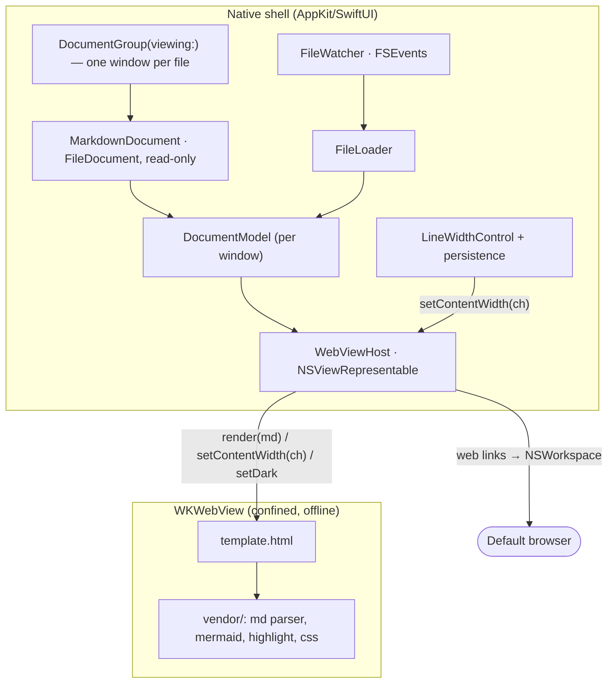

# SDS

## 1. Intro
- **Purpose:** Define the architecture and implementation approach for Markio — a native macOS Markdown previewer with GFM + Mermaid, rendered in a confined `WKWebView`, with an on-screen line-width control.
- **Rel to SRS:** Implements [REF:fr:open | FR-OPEN], [REF:fr:multidoc | FR-MULTIDOC], [REF:fr:gfm | FR-GFM], [REF:fr:mermaid | FR-MERMAID], [REF:fr:highlight | FR-HIGHLIGHT], [REF:fr:line-width | FR-LINE-WIDTH], [REF:fr:live-reload | FR-LIVE-RELOAD], [REF:fr:appearance | FR-APPEARANCE], [REF:fr:offline | FR-OFFLINE], [REF:fr:menu | FR-MENU], [REF:fr:find | FR-FIND], [REF:fr:math | FR-MATH], [REF:fr:frontmatter | FR-FRONTMATTER], [REF:fr:inline-html | FR-INLINE-HTML], [REF:fr:toc | FR-TOC], [REF:fr:code-copy | FR-CODE-COPY], [REF:fr:session-restore | FR-SESSION-RESTORE], [REF:fr:local-links | FR-LOCAL-LINKS], [REF:fr:quicklook | FR-QUICKLOOK], [REF:fr:ai-artifacts | FR-AI-ARTIFACTS], [REF:fr:compare | FR-COMPARE].

## 2. Arch
- **Diagram:**

```mermaid
flowchart TD
  subgraph Native["Native shell (AppKit/SwiftUI)"]
    Group["DocumentGroup(viewing:) — one window per file"]
    Doc[MarkdownDocument · FileDocument, read-only]
    Model["DocumentModel (per window)"]
    Loader[FileLoader]
    Watcher[FileWatcher · FSEvents]
    WidthCtl[LineWidthControl + persistence]
    Host[WebViewHost · NSViewRepresentable]
  end
  subgraph Web["WKWebView (confined, offline)"]
    Template[template.html]
    Vendor[vendor/: md parser, mermaid, highlight, css]
  end
  Group --> Doc --> Model
  Model --> Host
  Watcher --> Loader --> Model
  WidthCtl -- "setContentWidth(ch)" --> Host
  Host -- "render(md) / setContentWidth(ch) / setDark" --> Template
  Template --> Vendor
  Host -- "web links → NSWorkspace" --> Browser([Default browser])
```
- **Subsystems:** App shell (`DocumentGroup`) · Markdown document · Per-window model · File loader · File watcher · Render host (`WKWebView`) · Line-width control · TOC sidebar · Local link navigator · Compare coordinator · Shared engine library (`MarkioEngine`: vendored web bundle + locator) · Quick Look preview extension (`MarkioQuickLook.appex`).

## 3. Components

### 3.1 App shell [ANC:sds:app-shell]
- **Purpose:** `DocumentGroup(viewing: MarkdownDocument.self)` — one native window per file, with system File ▸ Open / Open Recent and state restoration. Window tabbing is disabled (`NSWindow.allowsAutomaticWindowTabbing = false` in `AppDelegate`) → strictly one window per document. Each window hosts its own render surface + a bottom-bar reading control. Implements [REF:fr:open | FR-OPEN], [REF:fr:multidoc | FR-MULTIDOC], [REF:fr:appearance | FR-APPEARANCE], [REF:fr:session-restore | FR-SESSION-RESTORE].
- **Session restore decision:** relaunch must reopen the documents open at quit deterministically. `AppDelegate` opts into secure state restoration (`applicationSupportsSecureRestorableState → true`) and sets `NSQuitAlwaysKeepsWindows = true` in the app's defaults domain (a `set`, not `register(defaults:)` — the registration domain loses to the user's NSGlobalDomain "Close windows when quitting" setting; the app domain overrides it). Document reopen + sandbox access are then fully system-managed (`DocumentGroup`/AppKit restoration) — no app-side session list, no bookmark code, no extra entitlement. Chosen over an own security-scoped-bookmark session store: platform-native, far less code, no new MAS review surface; trade-off: behavior rides on AppKit restoration machinery (verified in a real `.app`).
- **Interfaces:** `ContentView(document:fileURL:)` per window owns a `DocumentModel`. Opens originate from the system Open panel / Finder / Dock / `open` (handled by `DocumentGroup`), drag-drop onto a window (`@Environment(\.openDocument)` → new window), a command-line argument in dev (`AppDelegate` → `NSDocumentController.shared.openDocument`), or a clicked relative Markdown link ([REF:sds:local-links | LocalLinkNavigator] → the same `NSDocumentController` path, so one-window-per-document and Open Recent behave identically). No welcome screen: a fresh launch shows the system Open panel. Windows open at 900×820 on first launch; the system restores frames thereafter.
- **Deps:** AppKit, SwiftUI, UniformTypeIdentifiers.

### 3.1a MarkdownDocument [ANC:sds:markdown-document]
- **Purpose:** Read-only `FileDocument` carrying the file's Markdown text; the unit each `DocumentGroup` window is built around. Implements [REF:fr:multidoc | FR-MULTIDOC], [REF:fr:open | FR-OPEN].
- **Interfaces:** `readableContentTypes = [md, markdown, plainText]`; `writableContentTypes = []` (never writable → no Save, never dirty); `init(data:)` decodes UTF-8 and throws on invalid bytes (fail fast); `fileWrapper(configuration:)` throws (read-only).
- **Deps:** SwiftUI, UniformTypeIdentifiers.

### 3.1c WindowTitleSetter [ANC:sds:window-title]
- **Purpose:** Show the document's full path in the title bar instead of the bare file name `DocumentGroup` defaults to. Implements [REF:fr:multidoc | FR-MULTIDOC].
- **Interfaces:** `NSViewRepresentable` (zero-size) backed by `TitlePinningView`: on `viewDidMoveToWindow` it KVO-observes `NSWindow.title` and re-asserts the full path on every change (the document machinery re-syncs the file name asynchronously, so a one-shot set loses). Clears `representedURL` because, while set, AppKit shows the file name regardless of `title` — this deliberately drops the proxy icon.
- **Deps:** AppKit, SwiftUI.

### 3.1d FileCommands + FindCommands + MenuArtifactCleaner [ANC:sds:menu-commands]
- **Purpose:** Own the ordered read-only File surface, keep file actions out of Edit, and route commands to the focused document. Implements [REF:fr:menu | FR-MENU], [REF:fr:find | FR-FIND], [REF:fr:compare | FR-COMPARE].
- **Interfaces:** Three cooperating pieces. (1) `FileCommands: Commands` leaves DocumentGroup's native Open/Open Recent surface untouched and replaces `.saveItem` once with Copy File Path/Compare/Stop, a divider, then Close/Close All. One owner guarantees custom-command order. It reads `FocusedValues.documentFileURL` + the focused-object `DocumentModel` (`.focusedSceneObject`/`@FocusedObject` — `Commands` bodies observe `@Published` state, so items like Stop Comparing enable/disable without a focus change); `ContentView` publishes both per focused window. Copy delegates to `FilePathClipboard`, which validates a file URL + absolute path before clearing and writing exactly `URL.path` as `.string`; invalid input leaves the pasteboard untouched. Close uses the key window; Close All delegates to `NSDocumentController`, never an arbitrary window scan. (2) `FindCommands: Commands` owns only Find/Find Next/Find Previous in Edit through the same focused object; standard Edit clipboard commands remain untouched. The URL key lives in `FocusedDocumentValues.swift`. (3) `MenuArtifactCleaner.Installer` idempotently interposes on SwiftUI-owned top-level submenus before menu tracking, forwards each original delegate update first, removes only items whose public action is `NSDocumentController.newDocument(_:)`, then normalizes separators iff removal occurred. `AppDelegate` installs after launch and repairs delegate replacement from `applicationDidBecomeActive` / `applicationDidUpdate`. No timer, input monitor, title/index/private selector, or Open Recent reconstruction is used.
- **Decision:** Hybrid boundary: SwiftUI owns commands, focused routing, Open, and Open Recent; AppKit only filters the runtime-supplied New item through the documented menu-update and application lifecycle hooks. The installer runs before tracking because late interposition disrupts SwiftUI's dynamic Open Recent construction. This works around observed `DocumentGroup(viewing:)` menu drift without hand-building File. One command owner defines File order; Find stays separate from file utilities. Preserve the opened path without resolving symlinks. Copy File Path has no shortcut. The English-only bundle uses English custom titles. SwiftUI command effects require a real `.app` (`make app`/`prod`); `make dev` builds a degraded menu.
- **Deps:** SwiftUI, AppKit.

### 3.1b DocumentModel [ANC:sds:document-model]
- **Purpose:** Per-window state: owns the window's `PreviewController`, `FileWatcher`, and reading width; renders the document text and re-renders on appearance/live-reload. One instance per `DocumentGroup` window (no shared singleton). Implements [REF:fr:live-reload | FR-LIVE-RELOAD], [REF:fr:appearance | FR-APPEARANCE], [REF:fr:line-width | FR-LINE-WIDTH].
- **Interfaces:** `start(text:url:)` (one-time page setup + render + arm watcher), `setWidth(px)`, `appearanceChanged(dark:)`. Live reload re-reads `url` off-main and re-renders.
- **Deps:** AppKit, SwiftUI.

### 3.2 FileLoader [ANC:sds:file-loader]
- **Purpose:** Read file contents off the main thread; hand raw Markdown text to the render host. Implements [REF:fr:open | FR-OPEN].
- **Interfaces:** `load(url) -> String`; emits updates on change events from FileWatcher.
- **Deps:** Foundation.

### 3.3 FileWatcher [ANC:sds:file-watcher]
- **Purpose:** Watch the open file for external modification; trigger reload. Implements [REF:fr:live-reload | FR-LIVE-RELOAD].
- **Interfaces:** `watch(url, onChange)`; debounced; handles atomic-save replace (re-arm on vnode delete/rename).
- **Deps:** Dispatch / FSEvents.

### 3.4 WebViewHost [ANC:sds:webview-host]
- **Purpose:** Own the `WKWebView` (`PreviewController`, surfaced to SwiftUI via `PreviewView`); load the shell as a **self-contained document** (`ResourceLocator.selfContainedHTML()` inlines every `vendor/` `<link>`/`<script src>`, then `loadHTMLString(_:baseURL: nil)` — no `file:` subresource reads); push Markdown source and width into the page. Implements [REF:fr:gfm | FR-GFM], [REF:fr:mermaid | FR-MERMAID], [REF:fr:highlight | FR-HIGHLIGHT], [REF:fr:offline | FR-OFFLINE].
- **Interfaces:** `loadTemplate() async throws` (throws if the shell navigation fails, so a failed load is distinguishable from success), `render(_:)`, `setContentWidth(_ chars: Int) -> String?`, `setDark(_:)`, `outline() -> [TOCItem]`, `scrollToHeading(_:)`, `currentSection() -> String?`, `setScrollY(_ y: Double) -> Double?` (returns the browser-clamped applied position — [REF:fr:session-restore | FR-SESSION-RESTORE]) — all via `callAsyncJavaScript` into the page world; bridge failures are logged (`os.Logger`), not swallowed. Six one-way `WKScriptMessageHandler`s (each registered through a weak `ScriptMessageProxy` because the user-content controller retains its handlers strongly): `markioTOC` — the page pushes the current heading id on scroll → `onCurrentSectionChange` ([REF:fr:toc | FR-TOC]); `markioCopy` — a copy-button click pushes the block's raw code text, validated and written to an injected `NSPasteboard` (init parameter, default `.general`; tests pass a uniquely named pasteboard) with a `onCodeCopied` callback as test/UI hook ([REF:fr:code-copy | FR-CODE-COPY]); `markioScroll` — the page pushes the debounced scroll offset (validated: non-negative finite number) → `onScrollPositionChange` ([REF:fr:session-restore | FR-SESSION-RESTORE]); `markioLink` — a click on a relative Markdown link pushes the raw href (untrusted page data; validated non-empty string) → `onLinkActivated`, resolved and opened natively ([REF:fr:local-links | FR-LOCAL-LINKS], [REF:sds:local-links | LocalLinkNavigator]); `markioSyncScroll` — the page pushes the live scroll fraction while compare sync is on (validated: finite 0…1) → `onSyncScroll` ([REF:fr:compare | FR-COMPARE], [REF:sds:compare | CompareCoordinator]); `markioCopyImage` — a diagram Copy-PNG click pushes the base64 raster (validated: decodable, non-empty), written to the injected `NSPasteboard` as `.png` with an `onImageCopied` callback as test/UI hook ([REF:fr:mermaid-zoom | FR-MERMAID-ZOOM]); everything else is driven native→web, and web links are intercepted by the navigation delegate (`decidePolicyFor` → `LinkPolicy`: in-page `file:` / external via `NSWorkspace` / block). Network disabled via `WKWebView` config + navigation policy.
- **Decision:** Load via `loadHTMLString(baseURL: nil)` over `loadFileURL(allowingReadAccessTo:)`. Under the Mac App Store App Sandbox the confined WebContent process never completes a `file:` shell navigation → the preview stays blank (reproduced on a signed TestFlight build). Reading assets app-side (own-bundle reads are always allowed) and handing WebKit one inlined document avoids `file:` entirely. Separately, the `com.apple.security.network.client` entitlement is required even though nothing is fetched: without it the sandboxed WebContent helper fails to launch at all. Rendering stays fully offline — the navigation delegate blocks every web load.
- **Deps:** WebKit, os.

### 3.5 LineWidthControl [ANC:sds:line-width]
- **Purpose:** Bottom-bar slider bound to the reading width in **characters**; persists the value. Implements [REF:fr:line-width | FR-LINE-WIDTH].
- **Interfaces:** `ContentView.bottomBar` — a `.safeAreaInset(edge: .bottom)` bar holding a stepped `Slider` (range `minWidth…maxWidth`, `step`) plus a `N ch` readout. `ContentWidthStore` reads/writes `UserDefaults` key `contentWidthChars` (Int, characters) and `clamp`s to `[40, 200]` snapped to the 20-step grid; default 80. `DocumentModel.setWidth` → `PreviewController.setContentWidth(chars)` → JS `setContentWidth` sets `--content-width: <n>ch`.
- **Decision:** Character width via the CSS `ch` unit (absolute, window-independent up to the physical window-width cap — a column wider than the window is clipped to it) over a px or window-fraction width; a stepped slider (presets) over free-form. New `UserDefaults` key (`contentWidthChars`) so legacy px values are not misread. Note: `ch` = advance of the '0' glyph (a wide glyph), so a column set to N fits ≳N typical letters per line.
- **Deps:** SwiftUI, Foundation.

### 3.7 FindBar [ANC:sds:find-bar]
- **Purpose:** Native find-in-document surface. Implements [REF:fr:find | FR-FIND].
- **Interfaces:** Three cooperating pieces. (1) `DocumentModel` holds the find state (`findPresented`, `findQuery`, `findResult`) and the operations (`openFind`/`closeFind`/`runSearch`/`findNext`/`findPrev`), each delegating to `PreviewController`; on live-reload / appearance re-render it re-applies the active query. (2) `ContentView.findBar` — a floating HUD via `.overlay(alignment: .top)` (not a bar that pushes content): a `Capsule` filled with `windowBackgroundColor` (hairline border + shadow) holding a magnifier glyph, a borderless `FindTextField` (an `NSTextField` with no bezel/focus ring), an "N of M" counter (`FindResult.counterText`, unit-testable formatter), a separator, and round `HUDButton` prev/next/close controls. The field auto-focuses on open; Enter → next, Shift+Enter → previous, Esc/✕ → close. (3) `FindCommands: Commands` contains no file actions; the focused-object `DocumentModel` (`@FocusedObject`) routes Find / Find Next / Find Previous (⌘F / ⌘G / ⌘⇧G) to the focused window and keeps Next/Previous enablement live as `findResult` changes.
- **Bridge:** `PreviewController.search(_:) / findNext() / findPrev() / clearSearch()` call the page's `search`/`findNext`/`findPrev`/`clearSearch` via `callAsyncJavaScript`, returning `FindResult(count, current)`. Highlighting is done in the page — the "web view owns content rendering" rule; the shell (bar, menu, keys) stays native.
- **Matching (page):** two-phase. Phase 1 concatenates the visible text nodes (`collectTextNodes` exclusions: svg, KaTeX, code-copy UI, script/style) into one haystack with an offset→node map, inserting NUL (U+0000) between nodes whose nearest block ancestor differs (`BLOCK_TAGS` walk) — a query cannot contain NUL, so a match never spans a block boundary. Phase 2 finds case-insensitive occurrences and wraps them from the LAST to the FIRST (`splitText` only trims the tail of a mapped node, keeping earlier offsets valid). `__find.matches` holds logical matches — arrays of 1+ `<mark class="markio-find">` segments; a match crossing highlight.js token spans or inline formatting splits into several segments, all toggled to `markio-find-current` together; `setCurrent` scrolls the first segment into view. `clearSearch` unwraps every mark and `normalize()`s parents.
- **Minimap (page):** `div#markio-find-minimap` on `<body>` (outside `#content`, so `render()`'s innerHTML swap never orphans it) — a fixed 10 px strip at the right edge, `pointer-events: none`, one absolutely-positioned tick per logical match at `top = (firstSegment pageY / document scrollHeight) · 100%`; the current tick carries `markio-find-tick-current`. Rebuilt by every `search()`, repositioned on window `resize`, removed by `clearSearch()`. Indication-only (no click-to-jump) per the minimalism rule.
- **Deps:** SwiftUI, AppKit, WebKit.

### 3.8 TOCSidebar [ANC:sds:toc-sidebar]
- **Purpose:** Toggleable native sidebar with the document's heading tree: click-to-jump, current section highlighted while scrolling. Implements [REF:fr:toc | FR-TOC].
- **Interfaces:** Split along the find-feature boundary — native chrome, page-side content mechanics. (1) Page (`template.html`): after every render a DOM walk assigns GitHub-style slug ids (deduped `-1`, `-2`, …) to `#content` `h1–h6` and caches them in `__toc`; `getOutline()` → `[{level, text, id}]`; `scrollToHeading(id)` → `scrollIntoView({block:'start'})`; `getCurrentSection()` → id of the last heading at/above the viewport-top threshold; a synchronous `scroll` listener (no rAF — it doesn't fire in offscreen web views) posts the id to `webkit.messageHandlers.markioTOC` when it changes (guarded: absent handler → no-op). (2) `PreviewController`: `TOCItem` (level/text/id), `outline()`/`scrollToHeading(_:)`/`currentSection()`, `onCurrentSectionChange` callback fed by the `markioTOC` handler. (3) `DocumentModel`: `tocVisible` (persisted via `TOCStore`, `UserDefaults` key `tocSidebarVisible`, default hidden — a global reading preference like the line width), `outline`, `currentHeadingID`, `toggleTOC()`, `jumpToHeading(_:)`; `refreshOutline()` runs after every render (start / live reload / appearance), next to `reapplyFindIfActive`, so the tree survives re-renders ([REF:fr:live-reload | FR-LIVE-RELOAD]). (4) `TOCSidebar` view: fixed-width (220 pt) `ScrollView`+`LazyVStack` of plain buttons, indent 12 pt × (level−1), current row accent-highlighted and kept visible via `ScrollViewReader`; empty outline → dimmed placeholder. (5) `TOCCommands`: `View ▸ Show/Hide Table of Contents` (⌥⌘S) through the focused-object `DocumentModel` (`@FocusedObject`).
- **Decision:** Native sidebar in an `HStack` (not `NavigationSplitView`, which would drag a toolbar into the deliberately toolbar-less window; recorded as a possible future evolution) and a single read-only page→native message handler for the scroll-spy (not native polling — laggy and wasteful). This supersedes the earlier "no `WKScriptMessageHandler`" bridge decision; the surface stays minimal and auditable: one-way handlers with single-string payloads (`markioCopy` later joined it on the same pattern — [REF:fr:code-copy | FR-CODE-COPY]).
- **Deps:** SwiftUI, WebKit, Foundation.

### 3.9 ScrollPositionStore [ANC:sds:scroll-store]
- **Purpose:** Persist each document's last scroll position across launches so a reopened document (relaunch, Open Recent, ⌘O) restores the reading place. Implements [REF:fr:session-restore | FR-SESSION-RESTORE].
- **Interfaces:** `position(for: URL) -> Double?`, `setPosition(_: Double, for: URL)`. `UserDefaults` key `scrollPositions`: `[path: {y, seq}]`, bounded at 200 entries with least-recently-written eviction (`seq` is a monotonic sequence number — deterministic under same-second writes). Malformed stored values read as absent (the viewer must open regardless). Injectable suite for tests.
- **Flow:** page `scroll` listener (true 250 ms debounce) → `markioScroll` string → `PreviewController.onScrollPositionChange` → store write (continuous saving survives force quit); `DocumentModel.start` reads the store after the window's first render and calls `setScrollY` once (`started`-guarded — never re-fires while the user reads).
- **Deps:** Foundation.

### 3.10 LocalLinkNavigator [ANC:sds:local-links]
- **Purpose:** Make links inside rendered documents functional: relative Markdown links open in a new window, `#anchor` links scroll in place, `other.md#section` does both. Implements [REF:fr:local-links | FR-LOCAL-LINKS].
- **Interfaces:** Split along the established boundary — page intercepts, native decides. (1) Page (`template.html`): a delegated click listener on `#content` reads the RAW `href` attribute; `#fragment` → `preventDefault` + `scrollToHeading(decodeURIComponent(fragment))` (TOC slug ids — [REF:fr:toc | FR-TOC]); a scheme'd (`http:`, `mailto:`, `ftp:`, …) or protocol-relative href is left untouched for the navigation delegate (external → default browser, rest blocked — `LinkPolicy` unchanged); any other relative href is prevented, and only `.md`/`.markdown` targets post the raw href to the one-way `markioLink` handler — default-deny, non-Markdown relative clicks stay dead. (2) `LocalLink.swift`: `LocalLink(fileURL:anchor:)` + pure `LocalLinkResolver.resolve(href:documentURL:)` — accepts scheme-less relative paths with Markdown extensions only (percent-decoded, `..` traversal allowed, absolute paths rejected), splits the optional fragment. (3) `LocalLinkNavigator` (`@MainActor`, app-wide `shared`): `follow(href:from:)` resolves, records the anchor as pending (in-memory `[path: anchor]`, consume-once, nothing persisted), and opens the file; `attach(_:)` registers each started `DocumentModel` weakly as a `LocalLinkTarget` (`documentURL` + `navigate(toAnchor:)`). A freshly opened window consumes its pending anchor after the first render (`DocumentModel.start`, anchor wins over the saved scroll position); an already-open window is scrolled directly through its registered target (it never re-renders). The open primitive is injected for tests.
- **Sandbox decision (honest):** The MAS build has only `files.user-selected.read-only` — by App Sandbox semantics a sibling file that was never user-selected is not readable, so a silent "just open it" is impossible without new entitlements. Chosen model: per-file powerbox grant. `follow` checks `FileManager.isReadableFile`; readable targets (previously opened, recents — access is system-managed, plus everything in unsandboxed dev runs) open directly via `NSDocumentController.shared.openDocument` (the same path as command-line opens); a denied target gets an `NSOpenPanel` pre-pointed at it (`directoryURL`, Markdown content types, explanatory message) — the user's one "Open" click IS the grant; cancel is a no-op. A missing file is indistinguishable from a denied one inside the sandbox, so it shows the same panel (the user sees the absence and cancels). Chosen over folder-level security-scoped bookmarks (one grant per repo): bookmarks need a new entitlement (`bookmarks.app-scope`), persistent state with staleness handling, and app-store-factory signing coordination — recorded as the evolution path in the task's Follow-ups, not v1. Signed-build behavior is verified manually (`documents/checklists/local-links.md`); unit tests cover the grammar, interception, and anchor hand-off.
- **Deps:** AppKit, UniformTypeIdentifiers, Foundation.

### 3.12 Inline-diff compare [ANC:sds:compare]
- **Purpose:** Render the open document as an inline diff against a user-picked baseline version, in the same window. Implements [REF:fr:compare | FR-COMPARE].
- **Interfaces:** Split along the established boundary — native picks and reads, the page diffs and decorates. (1) Page (`template.html`): a markdown-it core ruler stamps `data-line-start`/`data-line-end` on top-level block tokens during every render; a vendored Myers line diff (`lineDiff`, O(ND), capped — an over-budget middle degrades to one delete+add run) compares baseline vs current source lines; `renderDiff(oldText, newText)` runs the NORMAL `render(newText)` pipeline first (GFM, sanitize, Mermaid, KaTeX, highlight — the diff never rewrites the render path), then adds `markio-diff-added` to top-level blocks whose line range intersects an added run, renders each removed run standalone (`md.render` + `sanitizeHtml`, Mermaid best-effort) into a `markio-diff-removed` wrapper inserted before the first block at/after the run's position (appended at the end when none), and finishes with `rebuildTOC()` so the TOC covers the diff view. CSS accents work in both themes (green inset bar/tint for added, red bar/tint + dimming for removed). (2) `PreviewController.renderDiff(old:new:)` — best-effort bridge call, logged like the rest. (3) `DocumentModel`: injectable baseline picker (production: powerbox `NSOpenPanel`, prompt "Compare", pre-pointed at the document's folder — the click is the sandbox grant, as in [REF:sds:local-links | LocalLinkNavigator]); `startCompare()` guards against picking the document's own file, reads the baseline text off-main, stores the baseline URL session-only, renders the diff, sets `@Published isCompared`; `stopCompare()` clears the baseline and re-renders plain; `reloadFromDisk` re-reads BOTH files and re-diffs while compared — an unreadable baseline logs and exits compare. (4) `CompareLayoutStore` (TOCStore twin, `UserDefaults` key `compareSplitLayout`, default inline) persists the layout as a global reading preference; `DocumentModel.compareSplit` publishes it and `setCompareSplit` re-renders the active diff. (5) SPLIT layout (`renderDiffSplit`): a `.markio-split` grid with `-old`/`-new` columns in the SAME scroll container — both versions rendered whole-text full-fidelity (never chunk-wise), removed blocks marked in the left column and added in the right by run intersection, then `alignSplit` pads each unchanged-run boundary pair to the same vertical offset with `margin-top` spacers (sequential top measurement; realigned after Mermaid settles, on window resize, and on width change — late async heights are best-effort). `rebuildTOC` skips `.markio-split-old`, so TOC/heading ids come from the current column only; find covers both columns. No scroll-event machinery exists in either layout. (6) [REF:sds:menu-commands | FileCommands] exposes `Compare…` (⇧⌘C) / `Stop Comparing` / checkmark `Compare Side by Side` (both enabled iff `isCompared`) through the focused-object `DocumentModel`.
- **Decision:** v3, replacing two paired windows with delta scroll mirroring: one window/one scroll removes the whole mirroring problem class (echo suppression, pixel-quantized deltas, edge clamping) by construction, and reading a change set beats reading two racing documents. Still read-only — no editing/merging; the earlier "NOT a diff editor" statement is amended to "not a diff EDITOR, but a diff READER". Block granularity v1 (a changed line marks its whole top-level block); word-level refinement and cross-construct removed-run rendering are recorded follow-ups. `CompareCoordinator`, the `markioSyncScroll` channel, and the page compare-sync block are deleted.
- **Deps:** AppKit, UniformTypeIdentifiers (panel), WebKit (via `PreviewController`).

## 4. Data
- **Entities:** No persistent model beyond `UserDefaults`: `contentWidthChars: Int` (reading width in characters, 40–200 by 20), `tocSidebarVisible: Bool` (TOC sidebar visibility, default `false` — [REF:fr:toc | FR-TOC]), `scrollPositions: [path: {y, seq}]` (per-document reading position, bounded — [REF:fr:session-restore | FR-SESSION-RESTORE]), `NSQuitAlwaysKeepsWindows: Bool` (app-domain override so quit keeps windows). Recent files + window state are fully system-managed by `DocumentGroup` (`NSDocumentController` recents, state restoration).
- **ERD:** N/A (no database).
- **Migration:** N/A.

## 5. Logic
- **Algos:** Render = read file → `render(markdown)` in page → md parser (`html:true`) produces HTML (a leading `---`…`---` YAML frontmatter tokenized first and rendered as a highlighted metadata box; math tokens `$…$`/`$$…$$` rendered inline via `katex.renderToString` at parse time) → **DOMPurify allowlist sanitize** ([REF:fr:inline-html | FR-INLINE-HTML]) → `innerHTML` → `mermaid.run()` over `.language-mermaid` blocks → highlight over remaining code blocks (an ANSI-bearing fence renders SGR colors via `renderAnsi` instead of syntax highlight — [REF:fr:ai-artifacts | FR-AI-ARTIFACTS]) → restore window scroll captured at render entry (WebKit clamps the scroll while Mermaid SVGs are momentarily their short source text; the restore keeps the reader's place on live reload — [REF:fr:live-reload | FR-LIVE-RELOAD]). Width = bottom-bar control → `setContentWidth(chars)` sets `--content-width: <n>ch`; content column `max-width: var(--content-width)` → an absolute N-character reading measure, window-independent. TOC = post-render heading walk (slug ids) → native pulls `getOutline()` after every render; page pushes the current section id on scroll via `markioTOC`; clicks jump via `scrollToHeading(id)` ([REF:fr:toc | FR-TOC]). Copy = post-render `decorateCodeBlocks()` wrap pass → delegated click posts raw `<code>` text via `markioCopy` → `PreviewController` writes `NSPasteboard` ([REF:fr:code-copy | FR-CODE-COPY]).
- **Rules:** Confine `WKWebView` to bundled file URLs; intercept external links → open in default browser via `NSWorkspace` (never navigate the view). Local links: the page intercepts clicks — `#anchor` scrolls in place, relative `.md` hrefs go to the native resolver/opener (new window; powerbox grant when sandbox-denied), everything else stays blocked ([REF:fr:local-links | FR-LOCAL-LINKS]). Compare: while a pair is live, each side posts its scroll FRACTION per scroll event over `markioSyncScroll`; the coordinator applies it to the peer via `setScrollFraction`, whose one-shot page-side suppression consumes the resulting event — no echo, no loop ([REF:fr:compare | FR-COMPARE]). Debounce file-change events. Load file I/O off the main thread; render calls marshaled to main.

## 6. Non-Functional
- **Scale/Fault/Sec/Logs:** Off-main-thread file reads keep UI responsive on large docs. Malformed Markdown → best-effort render, no crash. Security: no network (offline FR), minimal JS bridge — native→web calls, link interception, and five one-way page→native message handlers with single-string payloads (`markioTOC`, [REF:fr:toc | FR-TOC]; `markioCopy`, [REF:fr:code-copy | FR-CODE-COPY]; `markioScroll`, [REF:fr:session-restore | FR-SESSION-RESTORE]; `markioLink` — untrusted href gated by a default-deny resolver, [REF:fr:local-links | FR-LOCAL-LINKS]; `markioSyncScroll` — live compare scroll fraction, validated 0…1, [REF:fr:compare | FR-COMPARE]). Logging via `os.Logger`, subsystem `dev.markio`.

## 7. Constraints
- **Packaging:** `make app`/`make prod` assemble a real `Markio.app` (binary + SwiftPM resource bundle `Markio_MarkioEngine.bundle` + `packaging/Info.plist`, built under `.build/`), including the embedded Quick Look extension (`Contents/PlugIns/MarkioQuickLook.appex`, ad-hoc-signed). The bundle (bundle id + `CFBundleDocumentTypes` for `.md`/`.markdown`) is what gives macOS single-instance behavior, "Open With" routing, and one-window-per-document. The app icon is compiled at this step: `iconutil -c icns packaging/AppIcon.iconset` → `Contents/Resources/AppIcon.icns`, referenced by `CFBundleIconFile` ([REF:fr:icon | FR-ICON]). `make dev` runs the raw SwiftPM binary (no bundle → a separate process per launch, no icon) for fast iteration.
- **Swift 6 concurrency (AppKit glue):** (1) Make AppKit-bridging coordinators `@MainActor` — a global-actor-isolated class is implicitly `Sendable`, clearing "non-Sendable capture / sending self" errors. (2) `NotificationCenter`/KVO closures are `@Sendable`; when registered with `queue: .main`, run the isolated work via `MainActor.assumeIsolated { … }`. (3) A nonisolated `deinit` cannot touch non-Sendable stored properties — invalidate observers in `viewDidMoveToWindow(nil)`/on rebind, not `deinit`.
- **Platform:** macOS 14+ (Swift 6 language mode). Min raised from 13 → 14 to use modern SwiftUI `onChange` and keep a zero-warning build.
- **Simplified:** Read-only documents (no Save/edit); minimal chrome — one bottom-bar control (reading width in characters), no toolbar. System appearance only (no custom theme picker in v1). No welcome screen — fresh launch shows the system Open panel. TOC sidebar width is fixed (220 pt, not resizable) in v1.
- **Deferred:** Print/export, custom themes — explicitly out of v1 scope per minimalism priority. (Window-per-document, Open Recent, and state restoration come free from `DocumentGroup`; window tabbing is deliberately disabled — one document = one window.)
