# Mermaid side by side

Every example below is taken word for word from Mermaid's own documentation —
[`packages/mermaid/src/docs/syntax`](https://github.com/mermaid-js/mermaid/tree/f68935690ef7/packages/mermaid/src/docs/syntax),
commit `f68935690ef7`, 30 July 2026 — with one exception, marked where it appears. In
every picture Mermaid 11.16.1 is on the left, drawn through `mmdc`, and Markio 2 is
on the right, drawing the same source with CoreText and `CGPath`: no web view, no
diagram library.

Of the 36 examples shown here, Markio 2 draws all 36. The pictures are the
measure, not the count: what a comparison like this is for is the difference
between two drawings of one source, and that is what the notes below record.

The pages these come from hold 408 examples in all. Run end to end, both draw 403
of them: there is no example Markio 2 draws that Mermaid does not, and none
Mermaid draws that Markio 2 leaves as source. The five neither of them draws are
four ZenUML examples and one entity relationship diagram, all of which Mermaid
itself refuses.

The example chosen for each kind is that documentation page's headline one, and
for several kinds a second, harder example is shown as well — the one that used to
be refused. The C4 diagram written here is kept for the same reason: it was added
when no example on that page could be drawn.

## What this comparison turned up

Putting the two pictures side by side found faults that looking at ours alone
never did: a reader who has only one drawing cannot see what is missing from it.
Four rounds of comparison went through every example here, and every defect they
found is closed. They fell into five kinds.

**A picture that said something its source did not.** `--->` lost its arrowhead.
An edge naming a subgraph invented a box with the frame's name, so the picture held
both a frame and a box called `one`; the word names the frame now, and the edge
ends on it. A C4 boundary inside a boundary put every element in the innermost
frame and dropped the outer one; both frames are drawn now.
A cycle pushed every state in it onto one rank, so a machine that
returns to its start collapsed into a single row. A node declared inside a frame
stayed in whichever frame had named it first. A commit marked `REVERSE` and a merge
commit were both drawn as ordinary commits. A treemap showed neither its root nor
any value, a Sankey bar showed no amount, a Gantt axis showed no year, and an arm of
an `alt` written without a condition was drawn with no word on it at all.

**Two things drawn in one place.** A subgraph's name was clipped by its own frame,
a quadrant's point name could land on another point, a packet's bit numbers printed
over each other, and two edges between the same pair of boxes were drawn as one
line. Edges take a lane now and bow around whatever they would otherwise cross. An
edge label as wide as the gap left no line either side of it, and a message label
hung off both lifelines and crossed its own arrow; the room between ranks and
between lifelines is measured from the words that have to fit in it.

**A picture cut off at its own edge.** Each kind reported the width of the boxes it
laid out, which is not the width of the picture: a line bowed around a box and a
card title longer than its card both reached past them and were clipped by the
bitmap. What is drawn is measured now, and slid back into view if any of it landed
outside.

**Room and wording.** Siblings stood too close together. A small diagram opened in a
large window came back centred in a field of empty card — the width it is given is a
limit now, not a frame. An entity's attribute was written name first where the
source says type first, a requirement's rows carried the source's keywords instead
of words a person would say, and a relation between two boxes standing one over the
other was drawn leaning.

**A construct not drawn at all.** Eight examples here used to be shown as source,
and the reason was almost always the same one: something written inside something
else. A subgraph now holds a subgraph, a composite state holds its own machine, a
C4 boundary holds a boundary and a block holds a block, because each of them is
laid out as a picture of its own and then placed as if it were a single box. A
frame is a place an edge can end, so `outside --> subgraph1` stops on its border;
a `direction` line turns the frame it stands in; a `note` is a slip of paper laid
beside a class; C4's `Update…` lines repaint what has already been written; and a
board's preamble may say where its tickets live, which draws every ticket id as
the link it has become.

Mermaid's YAML preamble — `---` / `title:` / `---` — was not read at all, and it
accounted for a run of the refusals. Its `title` is read now and set above the
drawing, whatever kind the drawing is. `config` carries one setting this
understands, a board's ticket URL; a preamble carrying anything else still leaves
the fence as source, because those keys change how Mermaid draws, and a picture
drawn to settings other than the ones its author wrote is not the picture they
asked for.

## Flowchart

From [`flowchart.md`](https://github.com/mermaid-js/mermaid/blob/f68935690ef7/packages/mermaid/src/docs/syntax/flowchart.md), example 112.

```text
flowchart LR
    A[Hard edge] -->|Link text| B(Round edge)
    B --> C{Decision}
    C -->|One| D[Result one]
    C -->|Two| E[Result two]
```

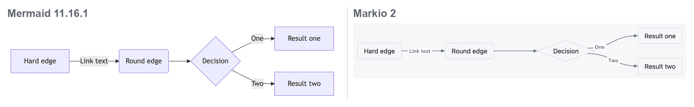

## Flowchart with subgraphs

From [`flowchart.md`](https://github.com/mermaid-js/mermaid/blob/f68935690ef7/packages/mermaid/src/docs/syntax/flowchart.md), example 95.

```text
flowchart TB
    c1-->a2
    subgraph one
    a1-->a2
    end
    subgraph two
    b1-->b2
    end
    subgraph three
    c1-->c2
    end
```

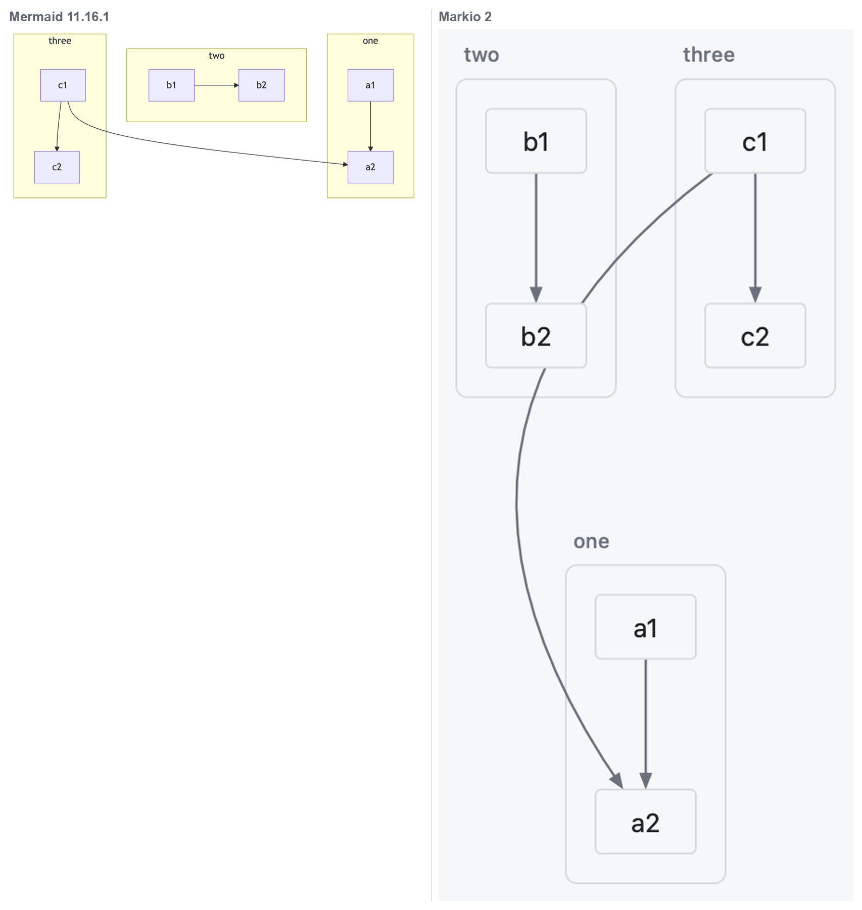

## Flowchart with an edge to a subgraph

From [`flowchart.md`](https://github.com/mermaid-js/mermaid/blob/f68935690ef7/packages/mermaid/src/docs/syntax/flowchart.md), example 97.

```text
flowchart TB
    c1-->a2
    subgraph one
    a1-->a2
    end
    subgraph two
    b1-->b2
    end
    subgraph three
    c1-->c2
    end
    one --> two
    three --> two
    two --> c2
```

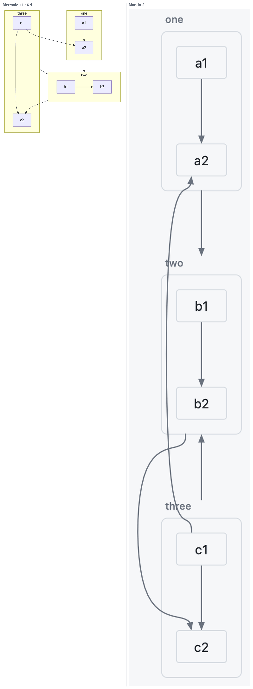

## Flowchart with a direction inside a subgraph

From [`flowchart.md`](https://github.com/mermaid-js/mermaid/blob/f68935690ef7/packages/mermaid/src/docs/syntax/flowchart.md), example 99.

```text
flowchart LR
    subgraph subgraph1
        direction TB
        top1[top] --> bottom1[bottom]
    end
    subgraph subgraph2
        direction TB
        top2[top] --> bottom2[bottom]
    end
    %% ^ These subgraphs are identical, except for the links to them:

    %% Link *to* subgraph1: subgraph1 direction is maintained
    outside --> subgraph1
    %% Link *within* subgraph2:
    %% subgraph2 inherits the direction of the top-level graph (LR)
    outside ---> top2
```

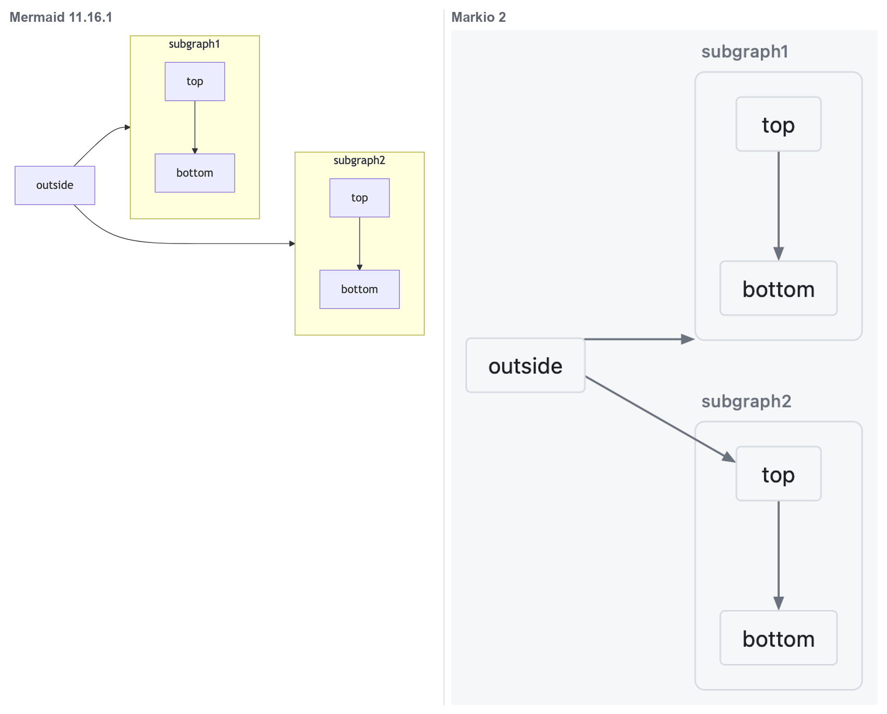

## Sequence diagram

From [`sequenceDiagram.md`](https://github.com/mermaid-js/mermaid/blob/f68935690ef7/packages/mermaid/src/docs/syntax/sequenceDiagram.md), example 25.

```text
sequenceDiagram
    Alice->>Bob: Hello Bob, how are you?
    alt is sick
        Bob->>Alice: Not so good :(
    else is well
        Bob->>Alice: Feeling fresh like a daisy
    end
    opt Extra response
        Bob->>Alice: Thanks for asking
    end
```

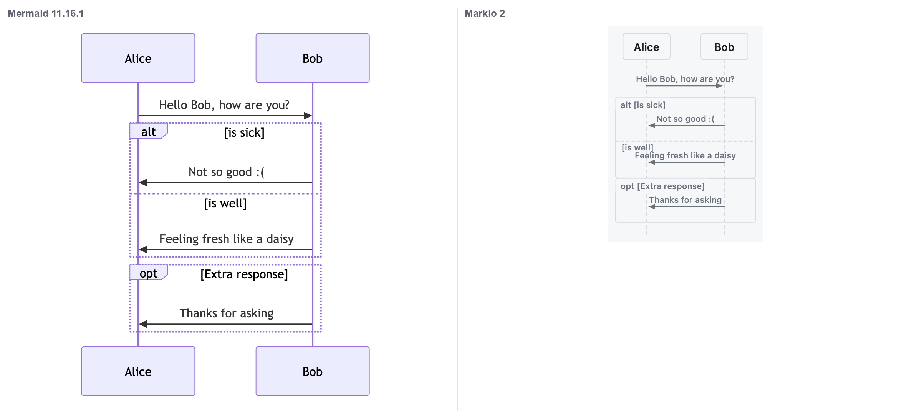

## Class diagram

From [`classDiagram.md`](https://github.com/mermaid-js/mermaid/blob/f68935690ef7/packages/mermaid/src/docs/syntax/classDiagram.md), example 10.

```text
classDiagram
classA <|-- classB
classC *-- classD
classE o-- classF
classG <-- classH
classI -- classJ
classK <.. classL
classM <|.. classN
classO .. classP
```

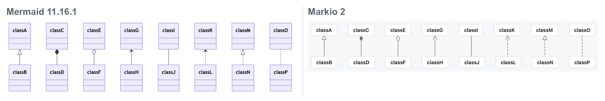

## Class diagram with notes

From [`classDiagram.md`](https://github.com/mermaid-js/mermaid/blob/f68935690ef7/packages/mermaid/src/docs/syntax/classDiagram.md), example 1.

```text
---
title: Animal example
---
classDiagram
    note "From Duck till Zebra"
    Animal <|-- Duck
    note for Duck "can fly<br>can swim<br>can dive<br>can help in debugging"
    Animal <|-- Fish
    Animal <|-- Zebra
    Animal : +int age
    Animal : +String gender
    Animal: +isMammal()
    Animal: +mate()
    class Duck{
        +String beakColor
        +swim()
        +quack()
    }
    class Fish{
        -int sizeInFeet
        -canEat()
    }
    class Zebra{
        +bool is_wild
        +run()
    }
```

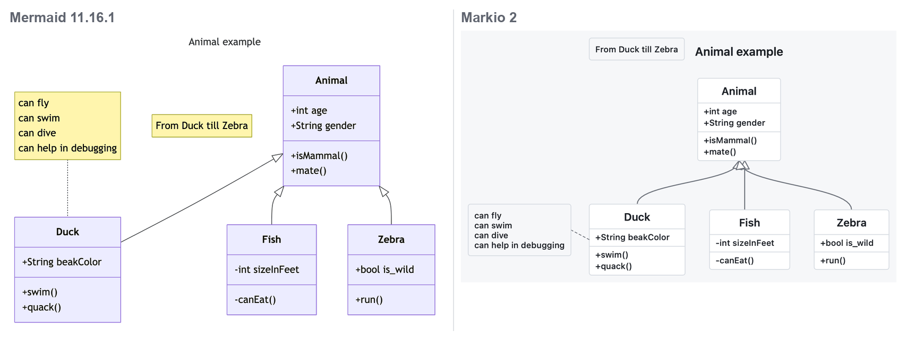

## State diagram

From [`stateDiagram.md`](https://github.com/mermaid-js/mermaid/blob/f68935690ef7/packages/mermaid/src/docs/syntax/stateDiagram.md), example 2.

```text
stateDiagram
    [*] --> Still
    Still --> [*]

    Still --> Moving
    Moving --> Still
    Moving --> Crash
    Crash --> [*]
```

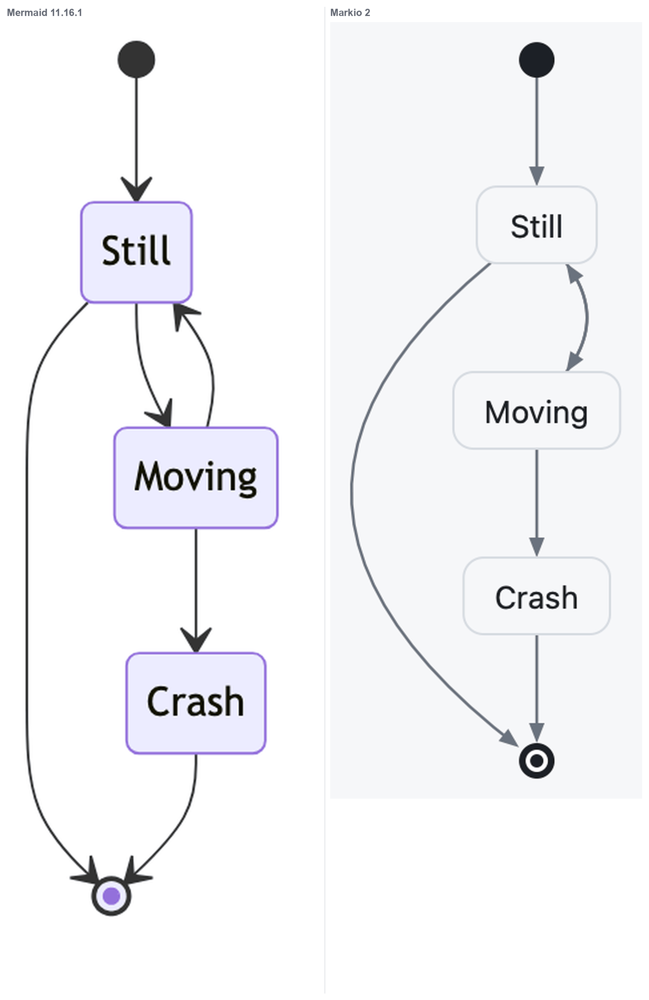

## State diagram with composite states

From [`stateDiagram.md`](https://github.com/mermaid-js/mermaid/blob/f68935690ef7/packages/mermaid/src/docs/syntax/stateDiagram.md), example 9.

```text
stateDiagram-v2
    [*] --> First
    state First {
        [*] --> second
        second --> [*]
    }

    [*] --> NamedComposite
    NamedComposite: Another Composite
    state NamedComposite {
        [*] --> namedSimple
        namedSimple --> [*]
        namedSimple: Another simple
    }
```

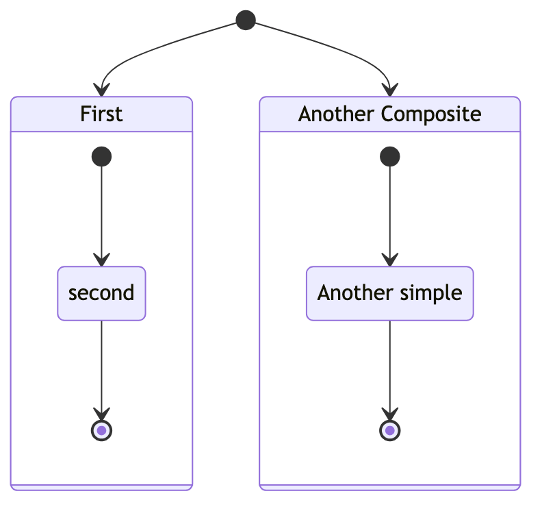

## Entity relationship diagram

From [`entityRelationshipDiagram.md`](https://github.com/mermaid-js/mermaid/blob/f68935690ef7/packages/mermaid/src/docs/syntax/entityRelationshipDiagram.md), example 2.

```text
erDiagram
    CUSTOMER ||--o{ ORDER : places
    CUSTOMER {
        string name
        string custNumber
        string sector
    }
    ORDER ||--|{ LINE-ITEM : contains
    ORDER {
        int orderNumber
        string deliveryAddress
    }
    LINE-ITEM {
        string productCode
        int quantity
        float pricePerUnit
    }
```

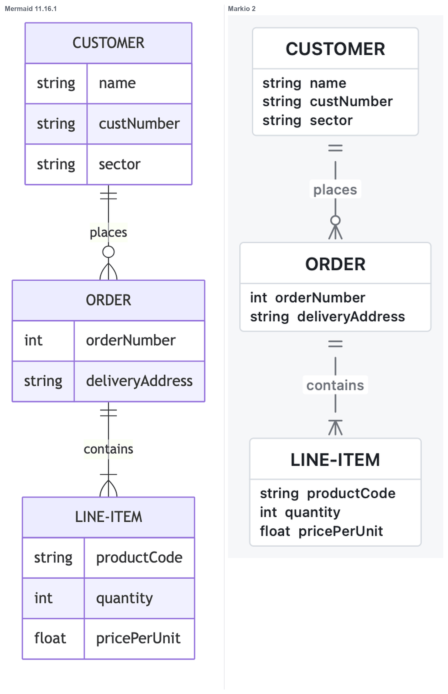

## Entity relationship diagram with a title

From [`entityRelationshipDiagram.md`](https://github.com/mermaid-js/mermaid/blob/f68935690ef7/packages/mermaid/src/docs/syntax/entityRelationshipDiagram.md), example 1.

```text
---
title: Order example
---
erDiagram
    CUSTOMER ||--o{ ORDER : places
    ORDER ||--|{ LINE-ITEM : contains
    CUSTOMER }|..|{ DELIVERY-ADDRESS : uses
```

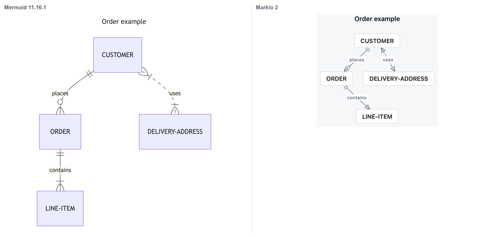

## User journey

From [`userJourney.md`](https://github.com/mermaid-js/mermaid/blob/f68935690ef7/packages/mermaid/src/docs/syntax/userJourney.md), example 1.

```text
journey
    title My working day
    section Go to work
      Make tea: 5: Me
      Go upstairs: 3: Me
      Do work: 1: Me, Cat
    section Go home
      Go downstairs: 5: Me
      Sit down: 5: Me
```

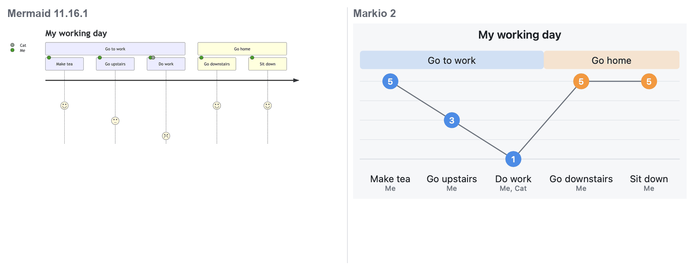

## Gantt chart

From [`gantt.md`](https://github.com/mermaid-js/mermaid/blob/f68935690ef7/packages/mermaid/src/docs/syntax/gantt.md), example 1.

```text
gantt
    title A Gantt Diagram
    dateFormat YYYY-MM-DD
    section Section
        A task          :a1, 2014-01-01, 30d
        Another task    :after a1, 20d
    section Another
        Task in Another :2014-01-12, 12d
        another task    :24d
```

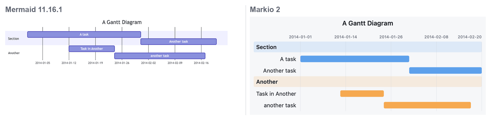

## Pie chart

From [`pie.md`](https://github.com/mermaid-js/mermaid/blob/f68935690ef7/packages/mermaid/src/docs/syntax/pie.md), example 1.

```text
pie title Pets adopted by volunteers
    "Dogs" : 386
    "Cats" : 85
    "Rats" : 15
```

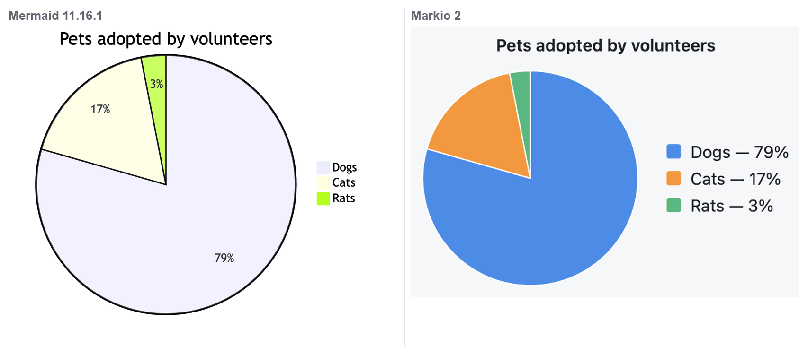

## Quadrant chart

From [`quadrantChart.md`](https://github.com/mermaid-js/mermaid/blob/f68935690ef7/packages/mermaid/src/docs/syntax/quadrantChart.md), example 1.

```text
quadrantChart
    title Reach and engagement of campaigns
    x-axis Low Reach --> High Reach
    y-axis Low Engagement --> High Engagement
    quadrant-1 We should expand
    quadrant-2 Need to promote
    quadrant-3 Re-evaluate
    quadrant-4 May be improved
    Campaign A: [0.3, 0.6]
    Campaign B: [0.45, 0.23]
    Campaign C: [0.57, 0.69]
    Campaign D: [0.78, 0.34]
    Campaign E: [0.40, 0.34]
    Campaign F: [0.35, 0.78]
```

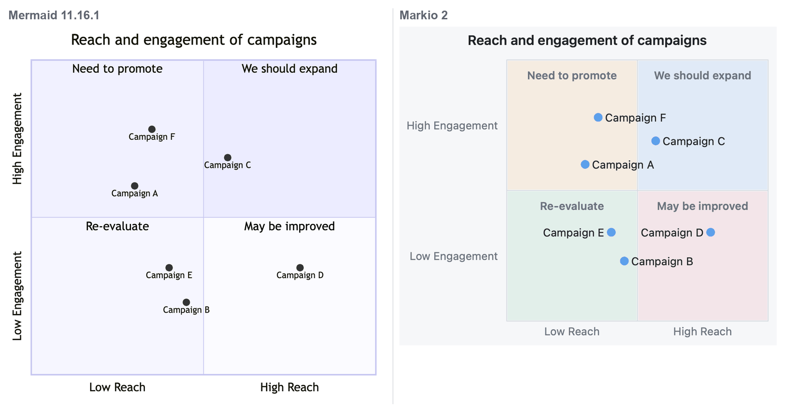

## Requirement diagram

From [`requirementDiagram.md`](https://github.com/mermaid-js/mermaid/blob/f68935690ef7/packages/mermaid/src/docs/syntax/requirementDiagram.md), example 1.

```text
    requirementDiagram

    requirement test_req {
    id: 1
    text: the test text.
    risk: high
    verifymethod: test
    }

    element test_entity {
    type: simulation
    }

    test_entity - satisfies -> test_req
```

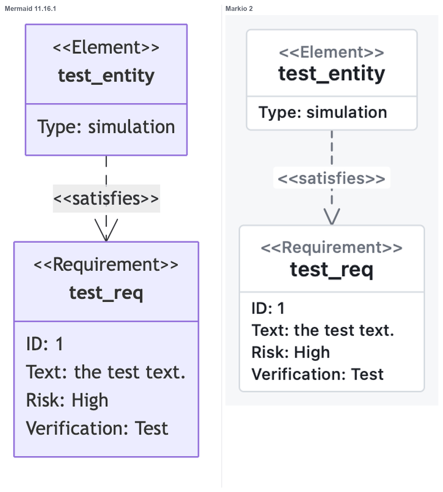

## Git graph

From [`gitgraph.md`](https://github.com/mermaid-js/mermaid/blob/f68935690ef7/packages/mermaid/src/docs/syntax/gitgraph.md), example 5.

```text
    gitGraph
       commit
       commit id: "Normal" tag: "v1.0.0"
       commit
       commit id: "Reverse" type: REVERSE tag: "RC_1"
       commit
       commit id: "Highlight" type: HIGHLIGHT tag: "8.8.4"
       commit
```

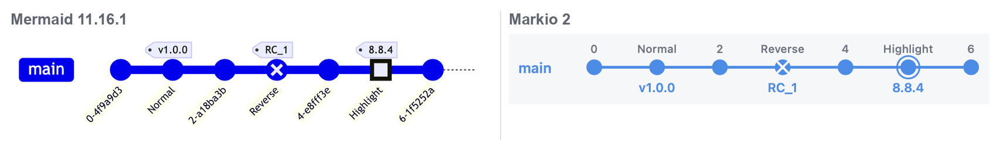

## Git graph with a title

From [`gitgraph.md`](https://github.com/mermaid-js/mermaid/blob/f68935690ef7/packages/mermaid/src/docs/syntax/gitgraph.md), example 1.

```text
---
title: Example Git diagram
---
gitGraph
   commit
   commit
   branch develop
   checkout develop
   commit
   commit
   checkout main
   merge develop
   commit
   commit
```

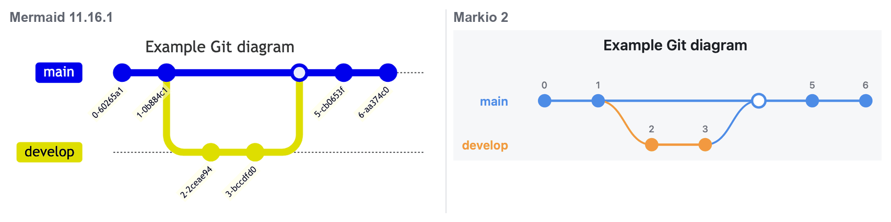

## Mindmap

From [`mindmap.md`](https://github.com/mermaid-js/mermaid/blob/f68935690ef7/packages/mermaid/src/docs/syntax/mindmap.md), example 12.

```text
mindmap
Root
    A
        B
      C
```

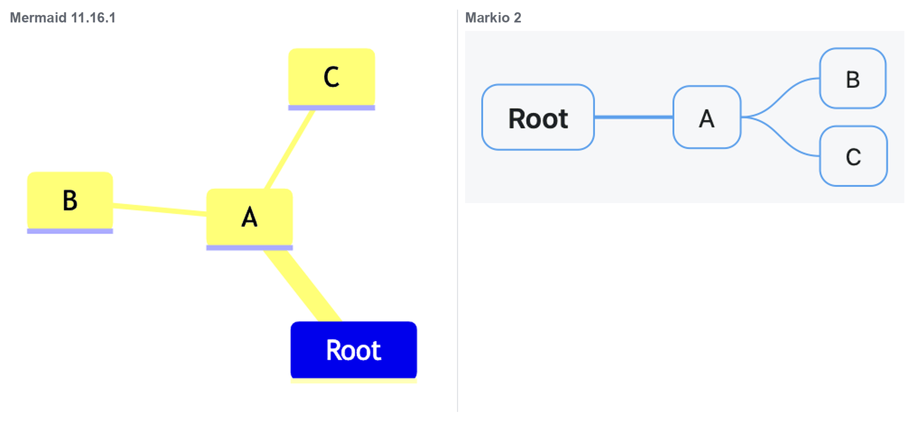

## Mindmap with icons

From [`mindmap.md`](https://github.com/mermaid-js/mermaid/blob/f68935690ef7/packages/mermaid/src/docs/syntax/mindmap.md), example 1.

```text
mindmap
  root((mindmap))
    Origins
      Long history
      ::icon(fa fa-book)
      Popularisation
        British popular psychology author Tony Buzan
    Research
      On effectiveness<br/>and features
      On Automatic creation
        Uses
            Creative techniques
            Strategic planning
            Argument mapping
    Tools
      Pen and paper
      Mermaid
```

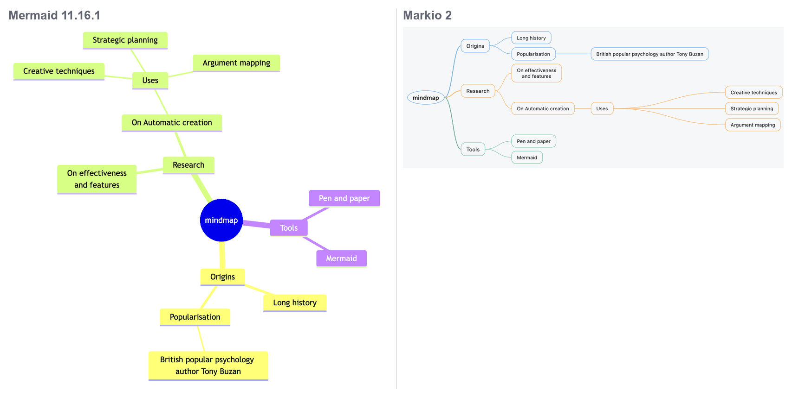

## Timeline

From [`timeline.md`](https://github.com/mermaid-js/mermaid/blob/f68935690ef7/packages/mermaid/src/docs/syntax/timeline.md), example 1.

```text
timeline
    title History of Social Media Platform
    2002 : LinkedIn
    2004 : Facebook
         : Google
    2005 : YouTube
    2006 : Twitter
```

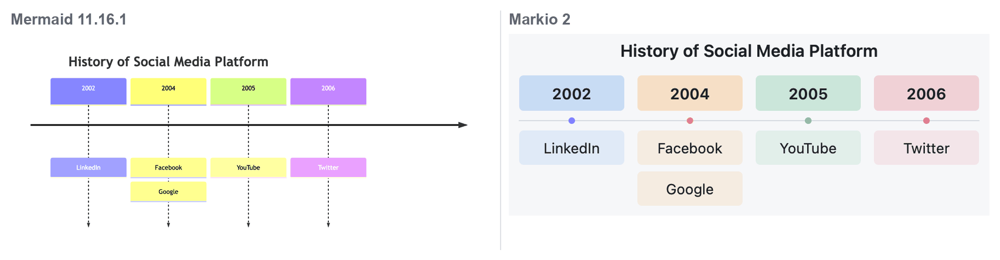

## ZenUML

From [`zenuml.md`](https://github.com/mermaid-js/mermaid/blob/f68935690ef7/packages/mermaid/src/docs/syntax/zenuml.md), example 15.

```text
zenuml
    Alice->Bob: Hello Bob, how are you?
    if(is_sick) {
      Bob->Alice: Not so good :(
    } else {
      Bob->Alice: Feeling fresh like a daisy
    }
```

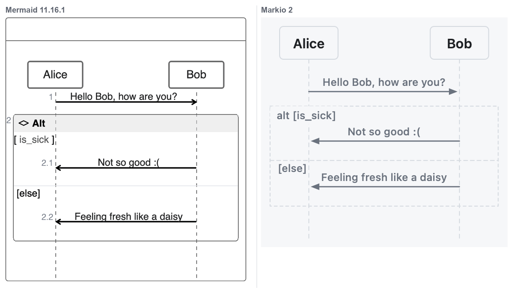

## Sankey diagram

From [`sankey.md`](https://github.com/mermaid-js/mermaid/blob/f68935690ef7/packages/mermaid/src/docs/syntax/sankey.md), example 2.

```text
sankey

%% source,target,value
Electricity grid,Over generation / exports,104.453
Electricity grid,Heating and cooling - homes,113.726
Electricity grid,H2 conversion,27.14
```

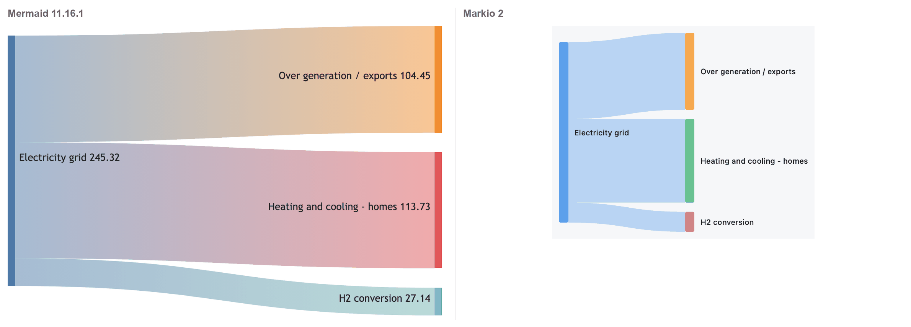

## XY chart

From [`xyChart.md`](https://github.com/mermaid-js/mermaid/blob/f68935690ef7/packages/mermaid/src/docs/syntax/xyChart.md), example 1.

```text
xychart
    title "Sales Revenue"
    x-axis [jan, feb, mar, apr, may, jun, jul, aug, sep, oct, nov, dec]
    y-axis "Revenue (in $)" 4000 --> 11000
    bar [5000, 6000, 7500, 8200, 9500, 10500, 11000, 10200, 9200, 8500, 7000, 6000]
    line [5000, 6000, 7500, 8200, 9500, 10500, 11000, 10200, 9200, 8500, 7000, 6000]
```

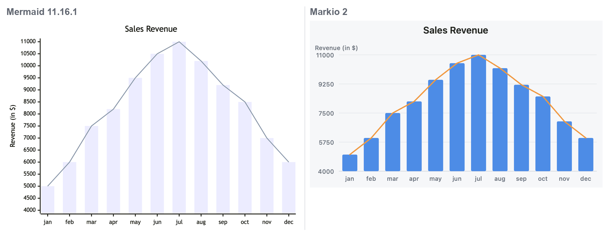

## Block diagram

From [`block.md`](https://github.com/mermaid-js/mermaid/blob/f68935690ef7/packages/mermaid/src/docs/syntax/block.md), example 19.

```text
block
  columns 3
  a space b
  c   d   e
```

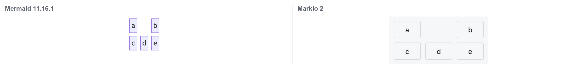

## Block diagram with a block inside a block

From [`block.md`](https://github.com/mermaid-js/mermaid/blob/f68935690ef7/packages/mermaid/src/docs/syntax/block.md), example 1.

```text
block
columns 1
  db(("DB"))
  blockArrowId6<["&nbsp;&nbsp;&nbsp;"]>(down)
  block:ID
    A
    B["A wide one in the middle"]
    C
  end
  space
  D
  ID --> D
  C --> D
  style B fill:#969,stroke:#333,stroke-width:4px
```

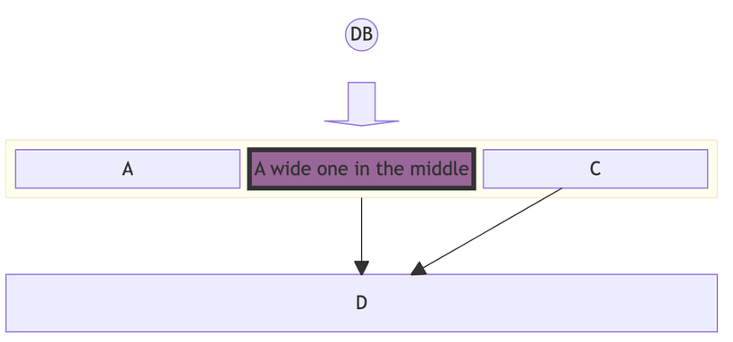

## Packet diagram

From [`packet.md`](https://github.com/mermaid-js/mermaid/blob/f68935690ef7/packages/mermaid/src/docs/syntax/packet.md), example 2.

```text
packet
title UDP Packet
+16: "Source Port"
+16: "Destination Port"
32-47: "Length"
48-63: "Checksum"
64-95: "Data (variable length)"
```

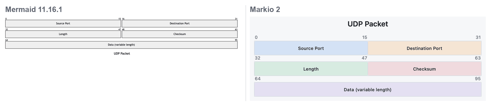

## Packet diagram with a title

From [`packet.md`](https://github.com/mermaid-js/mermaid/blob/f68935690ef7/packages/mermaid/src/docs/syntax/packet.md), example 1.

```text
---
title: "TCP Packet"
---
packet
0-15: "Source Port"
16-31: "Destination Port"
32-63: "Sequence Number"
64-95: "Acknowledgment Number"
96-99: "Data Offset"
100-105: "Reserved"
106: "URG"
107: "ACK"
108: "PSH"
109: "RST"
110: "SYN"
111: "FIN"
112-127: "Window"
128-143: "Checksum"
144-159: "Urgent Pointer"
160-191: "(Options and Padding)"
192-255: "Data (variable length)"
```

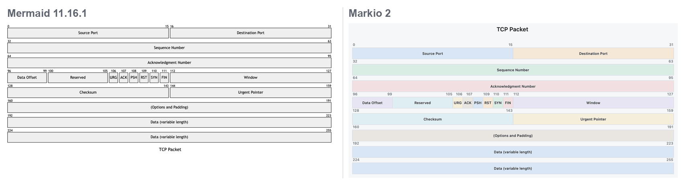

## Kanban board

From [`kanban.md`](https://github.com/mermaid-js/mermaid/blob/f68935690ef7/packages/mermaid/src/docs/syntax/kanban.md), example 2.

```text
kanban
todo[Todo]
  id3[Update Database Function]@{ ticket: MC-2037, assigned: 'knsv', priority: 'High' }
```

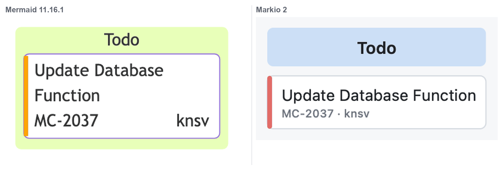

## Kanban board with a ticket base URL

From [`kanban.md`](https://github.com/mermaid-js/mermaid/blob/f68935690ef7/packages/mermaid/src/docs/syntax/kanban.md), example 3.

```text
---
config:
  kanban:
    ticketBaseUrl: 'https://mermaidchart.atlassian.net/browse/#TICKET#'
---
kanban
  Todo
    [Create Documentation]
    docs[Create Blog about the new diagram]
  [In progress]
    id6[Create renderer so that it works in all cases. We also add some extra text here for testing purposes. And some more just for the extra flare.]
  id9[Ready for deploy]
    id8[Design grammar]@{ assigned: 'knsv' }
  id10[Ready for test]
    id4[Create parsing tests]@{ ticket: MC-2038, assigned: 'K.Sveidqvist', priority: 'High' }
    id66[last item]@{ priority: 'Very Low', assigned: 'knsv' }
  id11[Done]
    id5[define getData]
    id2[Title of diagram is more than 100 chars when user duplicates diagram with 100 char]@{ ticket: MC-2036, priority: 'Very High'}
    id3[Update DB function]@{ ticket: MC-2037, assigned: knsv, priority: 'High' }

  id12[Can't reproduce]
    id3[Weird flickering in Firefox]
```

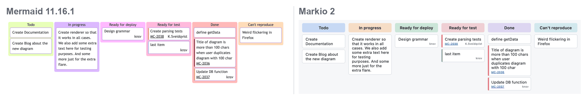

## Architecture diagram

From [`architecture.md`](https://github.com/mermaid-js/mermaid/blob/f68935690ef7/packages/mermaid/src/docs/syntax/architecture.md), example 1.

```text
architecture-beta
    group api(cloud)[API]

    service db(database)[Database] in api
    service disk1(disk)[Storage] in api
    service disk2(disk)[Storage] in api
    service server(server)[Server] in api

    db:L -- R:server
    disk1:T -- B:server
    disk2:T -- B:db
```

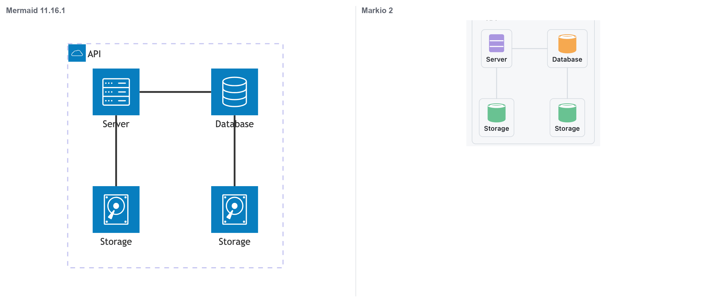

## C4 diagram

From [`c4.md`](https://github.com/mermaid-js/mermaid/blob/f68935690ef7/packages/mermaid/src/docs/syntax/c4.md), example 5.

```text
    C4Dynamic
    title Dynamic diagram for Internet Banking System - API Application

    ContainerDb(c4, "Database", "Relational Database Schema", "Stores user registration information, hashed authentication credentials, access logs, etc.")
    Container(c1, "Single-Page Application", "JavaScript and Angular", "Provides all of the Internet banking functionality to customers via their web browser.")
    Container_Boundary(b, "API Application") {
      Component(c3, "Security Component", "Spring Bean", "Provides functionality Related to signing in, changing passwords, etc.")
      Component(c2, "Sign In Controller", "Spring MVC Rest Controller", "Allows users to sign in to the Internet Banking System.")
    }
    Rel(c1, c2, "Submits credentials to", "JSON/HTTPS")
    Rel(c2, c3, "Calls isAuthenticated() on")
    Rel(c3, c4, "select * from users where username = ?", "JDBC")

    UpdateRelStyle(c1, c2, $textColor="red", $offsetY="-40")
    UpdateRelStyle(c2, c3, $textColor="red", $offsetX="-40", $offsetY="60")
    UpdateRelStyle(c3, c4, $textColor="red", $offsetY="-40", $offsetX="10")
```

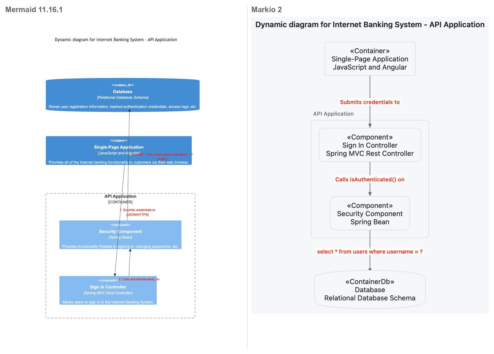

## C4 diagram, written here

Not from Mermaid's documentation: every C4 example there ends in an
`Update…` restyling, so this one was written for this comparison.

```text
C4Context
    title Reading a document
    Person(reader, "Reader", "Opens a file")
    System_Boundary(viewer, "Viewer") {
        System(parser, "Parser", "Blocks and inline runs")
        SystemDb(cache, "Layout cache", "Boxes already measured")
    }
    System_Ext(disk, "The file on disk")
    Rel(reader, parser, "Opens a file")
    Rel(parser, cache, "Fills")
    Rel(parser, disk, "Maps")
```

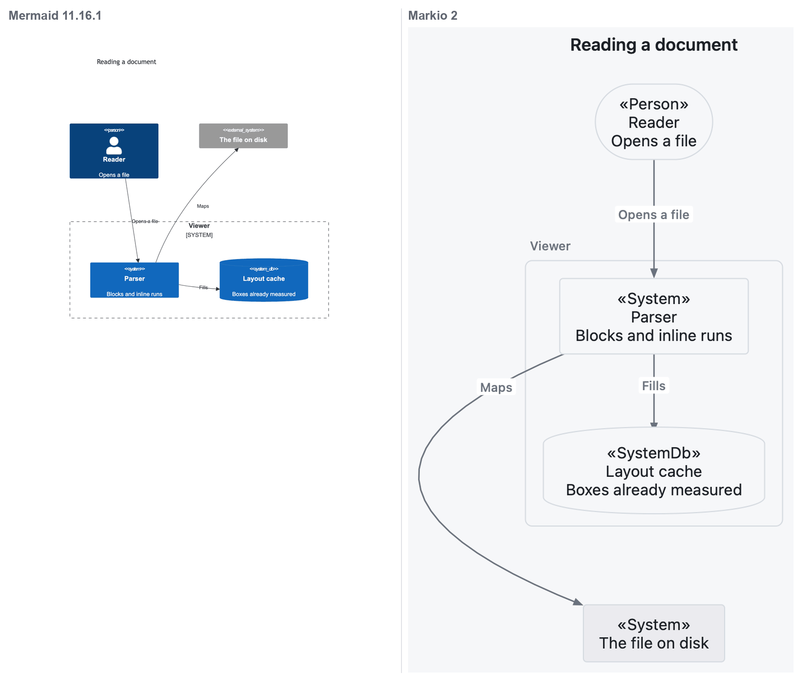

## Radar chart

From [`radar.md`](https://github.com/mermaid-js/mermaid/blob/f68935690ef7/packages/mermaid/src/docs/syntax/radar.md), example 2.

```text
radar-beta
  title Restaurant Comparison
  axis food["Food Quality"], service["Service"], price["Price"]
  axis ambiance["Ambiance"]

  curve a["Restaurant A"]{4, 3, 2, 4}
  curve b["Restaurant B"]{3, 4, 3, 3}
  curve c["Restaurant C"]{2, 3, 4, 2}
  curve d["Restaurant D"]{2, 2, 4, 3}

  graticule polygon
  max 5
```

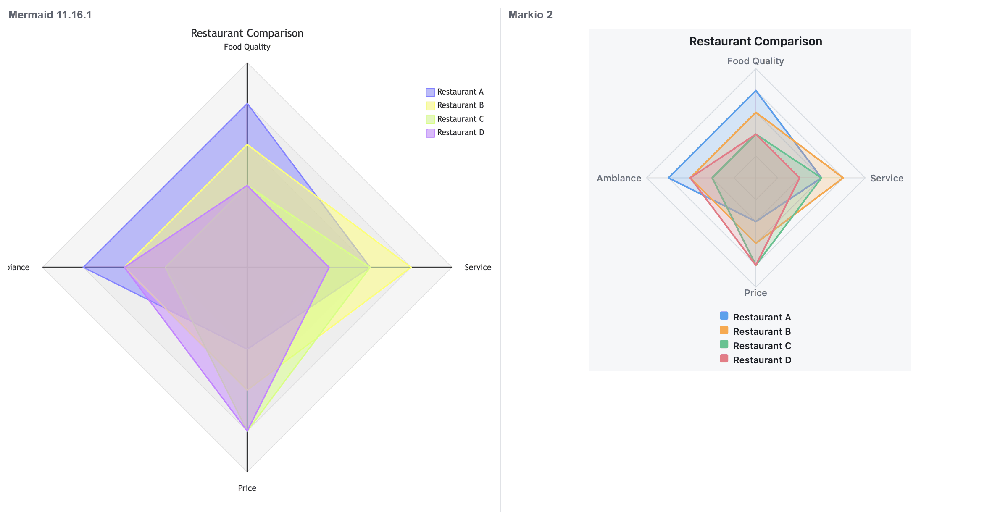

## Radar chart with a title

From [`radar.md`](https://github.com/mermaid-js/mermaid/blob/f68935690ef7/packages/mermaid/src/docs/syntax/radar.md), example 1.

```text
---
title: "Grades"
---
radar-beta
  axis m["Math"], s["Science"], e["English"]
  axis h["History"], g["Geography"], a["Art"]
  curve a["Alice"]{85, 90, 80, 70, 75, 90}
  curve b["Bob"]{70, 75, 85, 80, 90, 85}

  max 100
  min 0
```

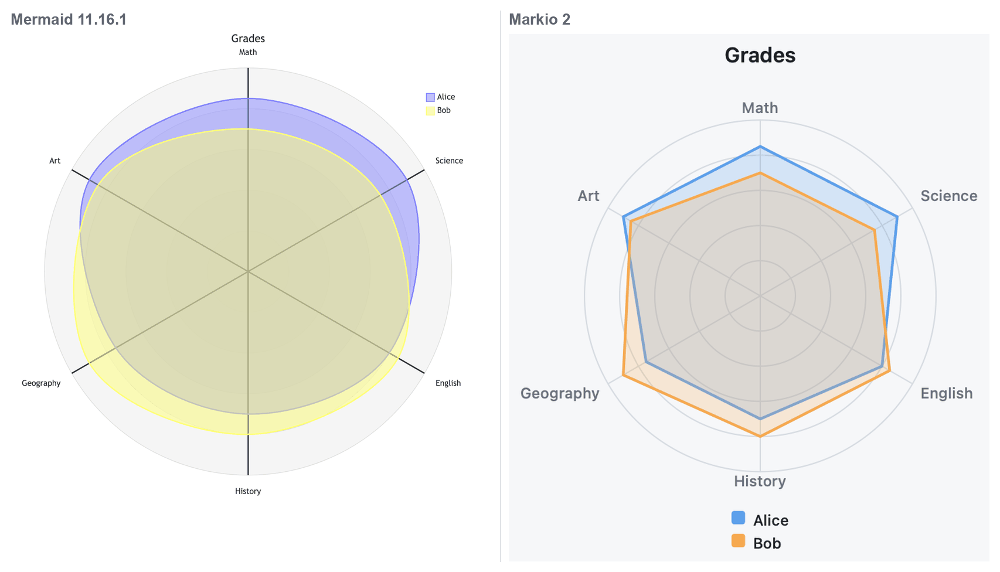

## Treemap

From [`treemap.md`](https://github.com/mermaid-js/mermaid/blob/f68935690ef7/packages/mermaid/src/docs/syntax/treemap.md), example 2.

```text
treemap-beta
"Products"
    "Electronics"
        "Phones": 50
        "Computers": 30
        "Accessories": 20
    "Clothing"
        "Men's": 40
        "Women's": 40
```

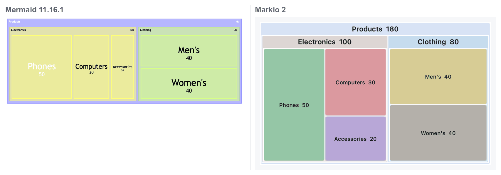
