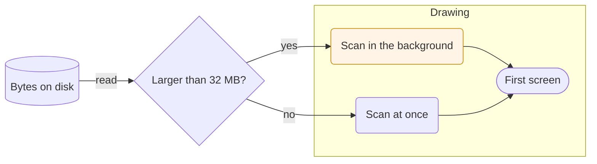
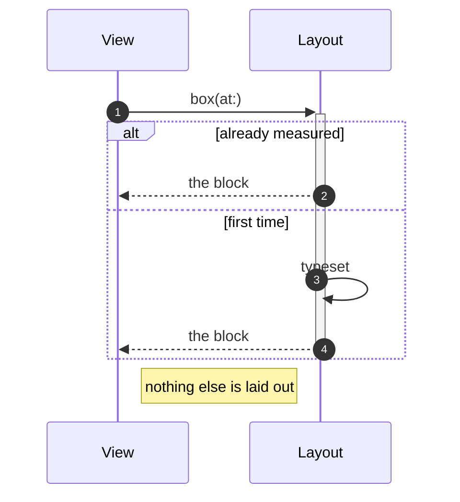
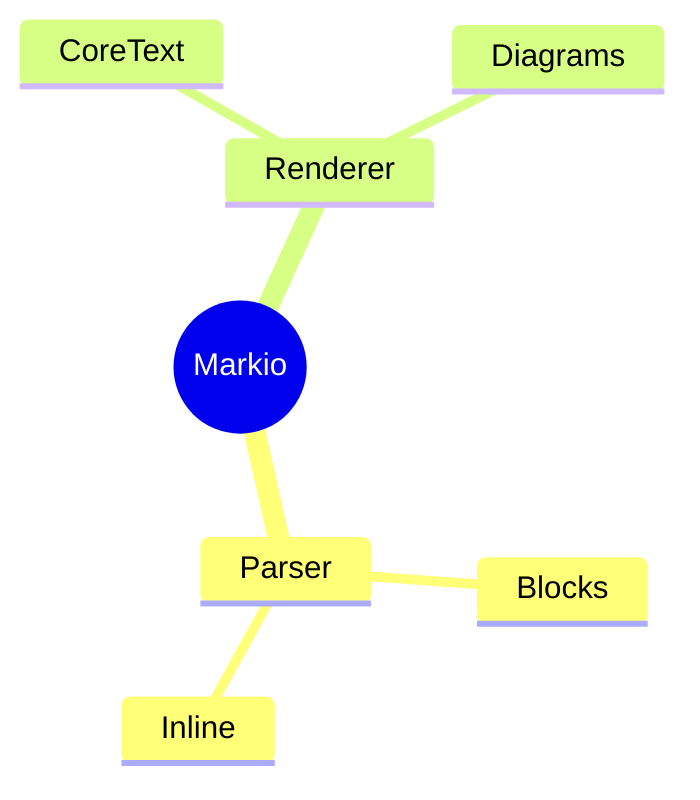
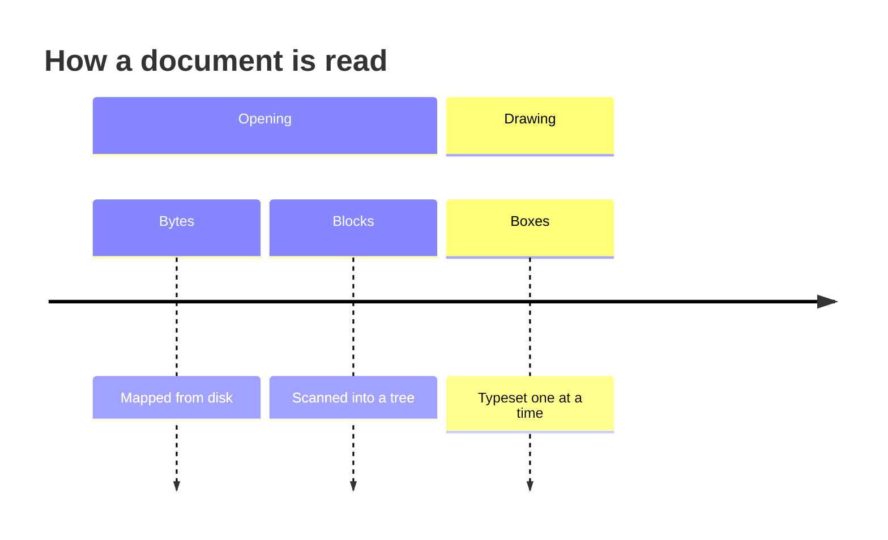
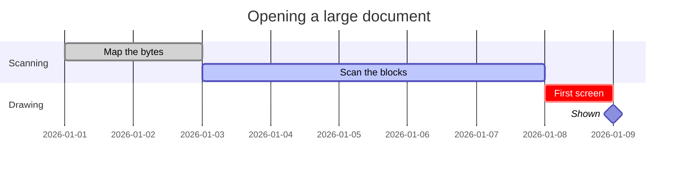
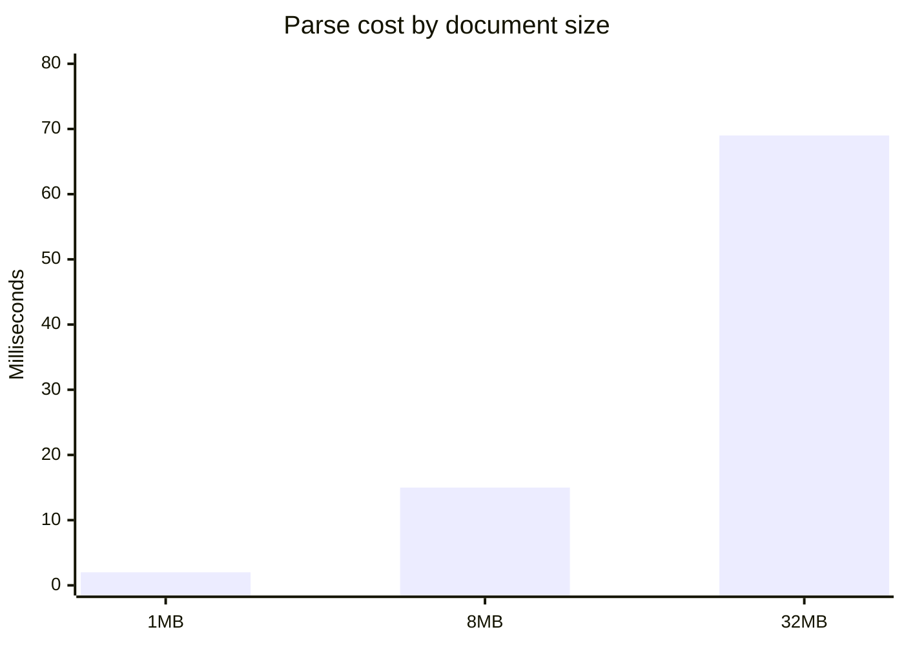
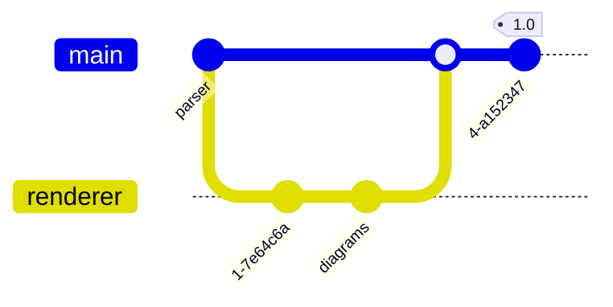

# Markio 2

A native macOS Markdown viewer with **no web view**, no HTML and no JavaScript.
Everything on this page was typeset by CoreText from a parser that reads the
file's bytes directly.

## What it renders

Ordinary prose with *emphasis*, **strong emphasis**, ***both at once***,
~~struck-through text~~, `inline code`, a [link](https://example.com), and an
entity or two — a dash &mdash; and a non-breaking space.

Press <kbd>⌘F</kbd> to search, <kbd>⌥⌘S</kbd> for the outline.

### Lists

- A bullet with **bold** inside
- Another one
  - Nested a level deeper
  - And a second nested item
- [x] A finished task
- [ ] An unfinished one

1. Ordered lists count properly
2. Even when they are long
3. And the numbers come from the source

### Quotes

> A block quote holds ordinary blocks.
>
> > Including another quote, one level deeper.

### Code

```swift
struct HeightIndex {
    private var tree: [Double]

    func index(atOffset y: CGFloat) -> Int {
        // Descend the Fenwick tree by powers of two.
        var target = Double(max(0, y))
        var position = 0
        return position
    }
}
```

```json
{ "blocks": 341868, "structure": "38% of the file", "parse": "69 ms" }
```

### Tables

| Document | Parse | Structure | Viewport inline |
| --- | ---: | ---: | :---: |
| 1 MB | 1.9 ms | 0.4 MB | 0.4 ms |
| 8 MB | 14.7 ms | 3.0 MB | 0.3 ms |
| 32 MB | 69.3 ms | 12.2 MB | 0.3 ms |

---

### Math and long words

Inline math such as $e^{i\pi} + 1 = 0$ is set with real glyphs, and so is a
formula with a fraction and a root in it:

$$x = \frac{-b \pm \sqrt{b^2 - 4ac}}{2a}$$

Inline, a sum keeps its limits beside it, $\sum_{i=1}^{n} i$; written out, they
move over and under the sign, beside a matrix and a case split:

$$\sum_{i=1}^{n} i^2 = \frac{n(n+1)(2n+1)}{6}
\quad \begin{pmatrix} a & b \\ c & d \end{pmatrix}
\quad f(x) = \begin{cases} x^2 & x \geq 0 \\ -x & x < 0 \end{cases}$$

Vectors and sets get their own letters: $\hat{v} \in \mathbb{R}^n$ and
$\sqrt[3]{8} = 2$. What the subset does not cover keeps its source instead of
being guessed at, as $\begin{array}{cc} a \end{array}$ does here. A long path
like
`/Users/someone/Library/Application Support/SomeApp/really/deep/path.json`
wraps instead of pushing the column sideways.

### Footnotes and shifted text

A claim that needs a source keeps its marker in the text,[^native] and the note
sits below with its label beside it. Water is H<sub>2</sub>O and the area of a
circle is πr<sup>2</sup>; neither makes the line it sits on taller than the rest.

[^native]: Drawn by CoreText, like every other line here.
[^unused]: A note nobody refers to is still shown, because deleting text the
    author wrote is not a viewer's job.

### Collapsible sections

<details>
<summary>A section that starts folded</summary>

Everything between the tags is ordinary Markdown, so a list, a table or a code
block goes here as it would anywhere else.

- folded away until the summary is clicked
- and back again on the second click

</details>

### A table with merged cells

<table>
<tr><th rowspan="2">Stage</th><th colspan="2">Cost</th></tr>
<tr><th>Time</th><th align="right">Memory</th></tr>
<tr><td>Parse</td><td>69 ms</td><td align="right">12.2 MB</td></tr>
<tr><td colspan="3">Markdown's own table syntax cannot merge cells; this is why
the tags are read.</td></tr>
</table>

### Diagrams














