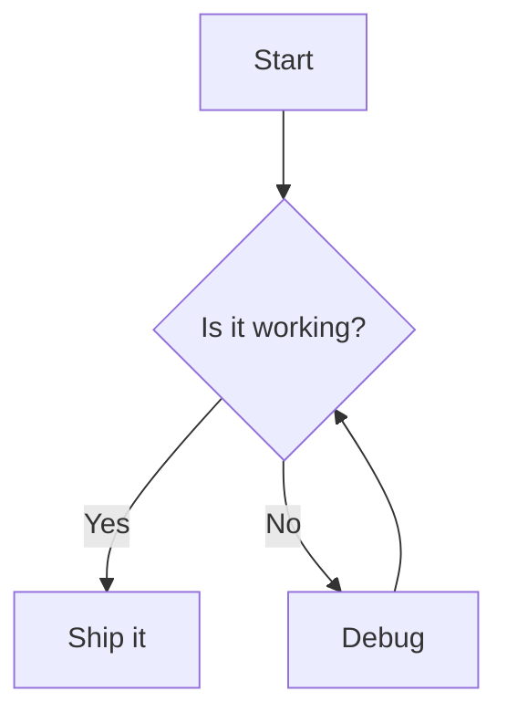
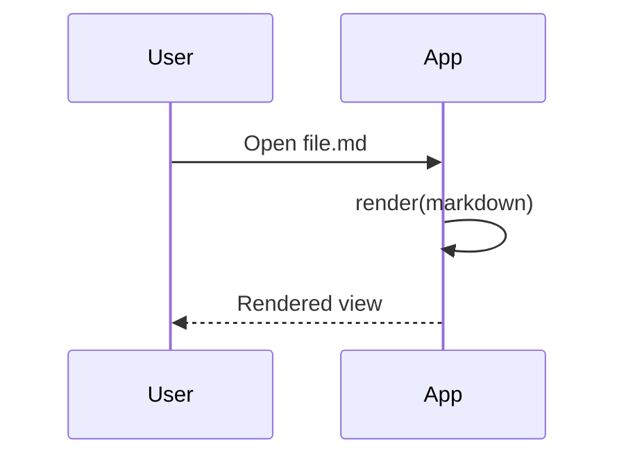
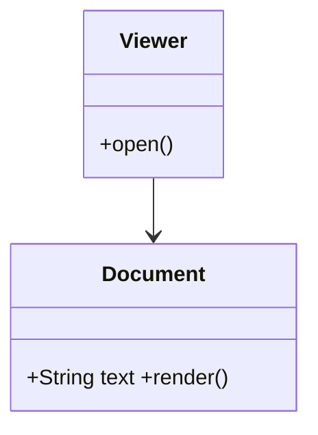
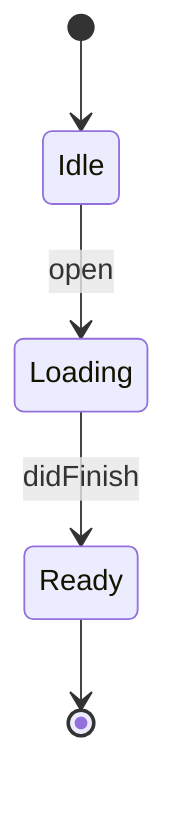
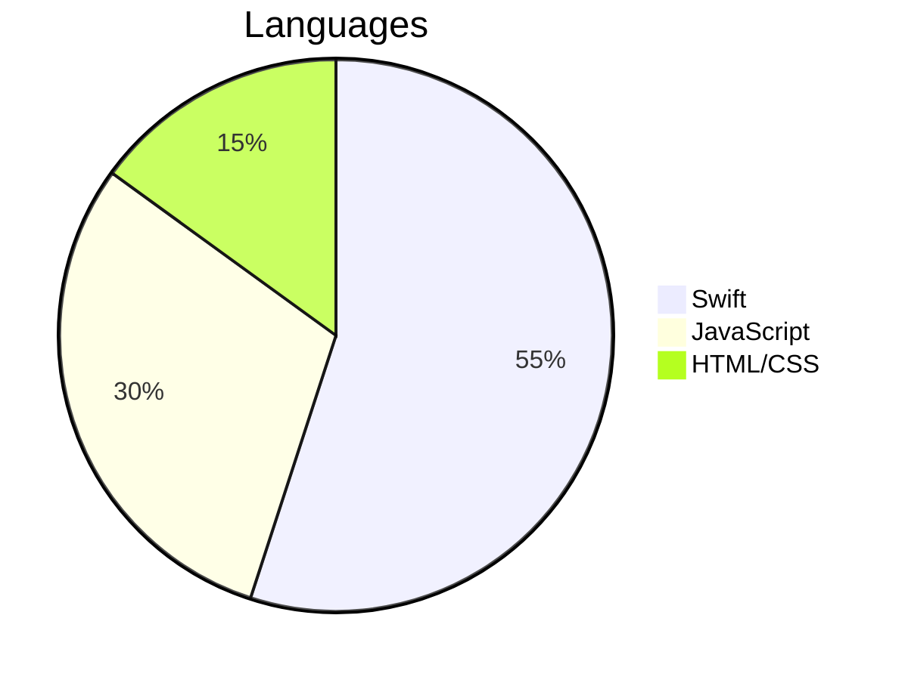

# Markdown Rendering Test Suite

> A single comprehensive document that exercises every construct a Markdown
> viewer is expected to render. Sourced from CommonMark spec, GitHub Flavored
> Markdown (cmark-gfm), markdown-it fixtures, highlight.js language samples, and
> Mermaid diagram examples. Use it to smoke-test rendering, syntax highlighting,
> diagrams, Unicode, and layout under different reading widths.

Markio feature coverage: GFM, Mermaid, syntax highlighting, offline assets,
adjustable reading width, find-in-document, LaTeX math (KaTeX).

---

## 1. Headings

# H1 ATX
## H2 ATX
### H3 ATX
#### H4 ATX
##### H5 ATX
###### H6 ATX
### Trailing hashes are optional ###
####### Seven hashes is NOT a heading (paragraph)

Setext H1
=========

Setext H2
---------

---

## 2. Paragraphs and line breaks

A normal paragraph of text that simply flows and wraps according to the reading
width. It contains enough words to demonstrate soft wrapping behaviour when the
column is narrow versus wide.

Soft break here
continues on the same rendered line.

Hard break via two trailing spaces  
lands on a new line.

Hard break via backslash\
also lands on a new line.

---

## 3. Emphasis, strong, strikethrough

*italic with asterisks* and _italic with underscores_.
**bold with asterisks** and __bold with underscores__.
***bold italic*** and ___bold italic___.
Nested **bold _italic_ inside** and *italic `code` inside*.
~~strikethrough (GFM)~~ and ~~nested **bold** strike~~.
Intraword emphasis: un*frigging*believable, but not un_frigging_believable.

---

## 4. Blockquotes

> Level 1 blockquote.
>
> > Level 2 nested.
> >
> > > Level 3 nested with a list:
> > > - item one
> > > - item two
> > >
> > > And a code span `inside` a deep quote.

> Blockquote containing a fenced block:
>
> ```js
> const q = "code inside a quote";
> ```

---

## 5. Lists

Unordered, three markers:

- dash item
* star item
+ plus item

Ordered with custom start:

3. three
4. four
5. five

Deeply nested (loose):

- a
  - a.1
    - a.1.1
      - a.1.1.1
        - a.1.1.1.1
          - a.1.1.1.1.1 (deep)

Tight list:

1. one
2. two
3. three

Task list (GFM):

- [x] completed task
- [ ] open task
- [ ] task with `code` and **bold**
  - [x] nested done
  - [ ] nested todo

Mixed content list item:

1. A paragraph in a list.

   A second paragraph in the same item.

   > A quote in a list item.

   ```
   a code block in a list item
   ```

---

## 6. Code

Inline `code`, inline with backtick `` a ` b ``, and a long inline
`this_is_a_very_long_inline_code_token_that_should_not_wrap_and_may_overflow_the_column_width`.

Indented code block:

    function indented() {
      return 42;
    }

Fenced (backticks) no language:

```
plain fenced code
no highlighting
```

Fenced (tildes):

~~~
tilde fenced code
~~~

### Syntax highlighting across languages (highlight.js)

```js
// JavaScript
export async function fetchUser(id) {
  const res = await fetch(`/api/users/${id}`);
  if (!res.ok) throw new Error(`HTTP ${res.status}`);
  return res.json();
}
```

```python
# Python
from dataclasses import dataclass

@dataclass
class Point:
    x: float
    y: float
    def norm(self) -> float:
        return (self.x ** 2 + self.y ** 2) ** 0.5
```

```swift
// Swift
struct Counter {
    private(set) var value = 0
    mutating func increment(by n: Int = 1) { value += n }
}
let c = Counter()
```

```rust
// Rust
fn main() {
    let nums = vec![1, 2, 3];
    let sum: i32 = nums.iter().sum();
    println!("sum = {sum}");
}
```

```go
// Go
package main

import "fmt"

func main() {
    fmt.Println("hello", 1<<10)
}
```

```json
{ "name": "markio", "version": "1.0", "offline": true, "list": [1, 2, 3] }
```

```bash
#!/usr/bin/env bash
set -euo pipefail
for f in *.md; do echo "processing $f"; done
```

```sql
SELECT id, name FROM users WHERE created_at > NOW() - INTERVAL '7 days' ORDER BY id;
```

```html
<!DOCTYPE html>
<div class="card"><h1>Title</h1><p>Body &amp; more</p></div>
```

```css
.markdown-body { max-width: 80ch; margin: 0 auto; color: CanvasText; }
```

```diff
- old line
+ new line
  unchanged
```

```yaml
name: build
on: [push]
jobs:
  test:
    runs-on: macos-latest
```

Unknown language falls back to plain:

```this-is-not-a-language
just some text ¯\_(ツ)_/¯
```

---

## 7. Horizontal rules

---
***
___

---

## 8. Links

Inline [link](https://example.com) and [with title](https://example.com "Example Title").

Reference [full][ref], [collapsed][], and [shortcut] styles.

[ref]: https://example.com/ref
[collapsed]: https://example.com/collapsed
[shortcut]: https://example.com/shortcut

Autolinks: <https://example.com> and <mailto:test@example.com>.

GFM bare autolinks: https://github.com/korchasa/markio and www.example.com and
contact test@example.com.

Link with `code` and **bold**: [**bold `code` link**](https://example.com).

---

## 9. Images

Inline image: .

Reference image: ![alt][img].

[img]: https://placehold.co/48x48

Broken image (should degrade gracefully): .

---

## 10. Tables (GFM)

| Left | Center | Right |
|:-----|:------:|------:|
| a | b | c |
| longer cell content | centered | 123.45 |
| `code` | **bold** | *italic* |

Ragged table (fewer/extra cells):

| A | B | C |
|---|---|---|
| 1 | 2 |
| x | y | z | extra ignored |

Wide table (horizontal overflow / width stress):

| Column one is wide | Column two is also quite wide | Column three overflow | Column four | Column five |
|---|---|---|---|---|
| value with a fairly long piece of text | another long value here for testing | overflow-x behaviour check | 4 | 5 |

---

## 11. Footnotes and definition lists (plugin-dependent)

A statement needing a footnote.[^1] And another.[^long]

[^1]: The first footnote.
[^long]: A longer footnote with `code` and **formatting** across
    multiple lines to test continuation.

Term
: Definition of the term (definition lists are non-standard; may render literally).

---

## 12. Raw HTML (viewer runs with html:false — must be escaped/inert)

<div class="danger" onclick="alert('xss')">Block HTML should not execute.</div>

Inline <b>HTML</b> and  must not run scripts.

<script>window.__pwned = true;</script>

<style>body { background: red !important; }</style>

---

## 13. Escapes and character references

Backslash escapes: \*not italic\* \`not code\` \# not a heading \[not a link\].

Entity references: &amp; &lt; &gt; &copy; &hearts; &#169; &#x2764;.

---

## 14. Mermaid diagrams

Flowchart:



Sequence:



Class:



State:



Pie:



Malformed diagram (must not crash the page; source stays visible):

```mermaid
graph TD
  A --> ??? this is not valid mermaid @@@
```

---

## 15. Unicode, emoji, scripts

Latin accents: café, naïve, Zürich, piñata, Đorđe.
Cyrillic: Привет, мир — проверка отображения кириллицы.
CJK: 你好世界 · こんにちは · 안녕하세요.
RTL Arabic: مرحبا بالعالم (right-to-left).
RTL Hebrew: שלום עולם.
Emoji: 🌍🚀✅❌📄🔥👩‍💻🧑🏽‍🚀 (ZWJ sequences and skin tones).
Combining marks: a̐éö̲, and math-ish: ∑ ∫ √ ≠ ≤ ≥ ∞ π.

---

## 16. Math (KaTeX — inline and block LaTeX render as typeset math)

Inline: $E = mc^2$ and $\frac{-b \pm \sqrt{b^2 - 4ac}}{2a}$.

Block:

$$
\int_0^\infty e^{-x^2}\,dx = \frac{\sqrt{\pi}}{2}
$$

---

## 17. Edge cases and stress

Unclosed fence at end of a section (parser recovery):

```js
const oops = "this fence is never closed"

## 18. Layout / width stress

A single very long unbreakable token to test horizontal overflow and the reading
width control:

Loooooooooooooooooooooooooooooooooooooooooooooooooooooooooooooooooooooooooooooooooooooooooooooooooooooooooooooooooooooooooooooooooooooooooooooooooooooooooong

A very long normal line to test soft wrapping at 40ch versus 200ch reading width, containing many words so the difference between a narrow column and a wide column is clearly visible when dragging the reading-width slider from its minimum to its maximum extent across the whole range.

Many links in one paragraph (linkify stress): https://a.example https://b.example https://c.example https://d.example https://e.example test1@example.com test2@example.com www.f.example www.g.example https://h.example/very/long/path/segment/that/keeps/going/and/going?q=1&r=2&s=3#fragment

Nested inline combination: **bold _italic ~~strike `code` https://auto.link~~_ end**.

---

## 19. Deeply nested blockquote + list + code (combined)

> - Quoted list item
>   1. Ordered inside
>      - Unordered inside
>        ```python
>        def deep(): return "nested code in quoted nested list"
>        ```
>   2. Second
> - Another quoted item

---

End of test suite.
